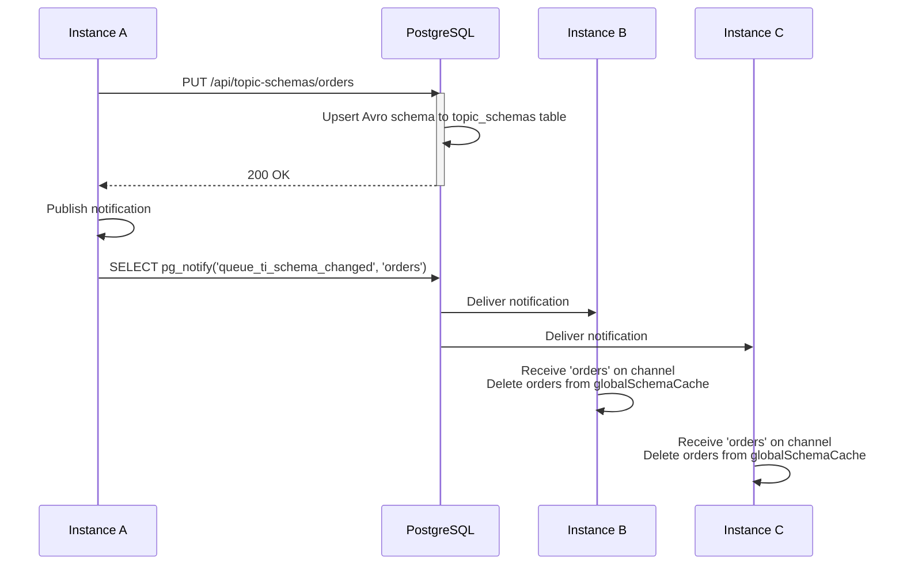
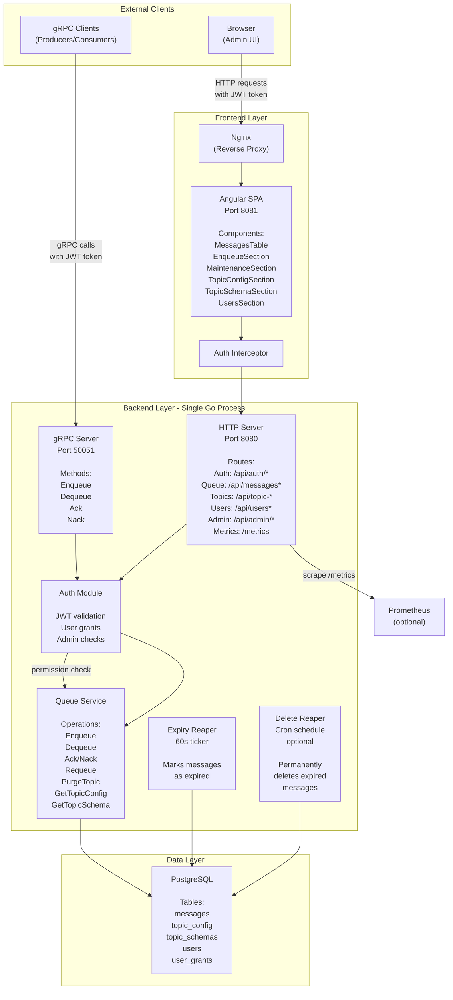
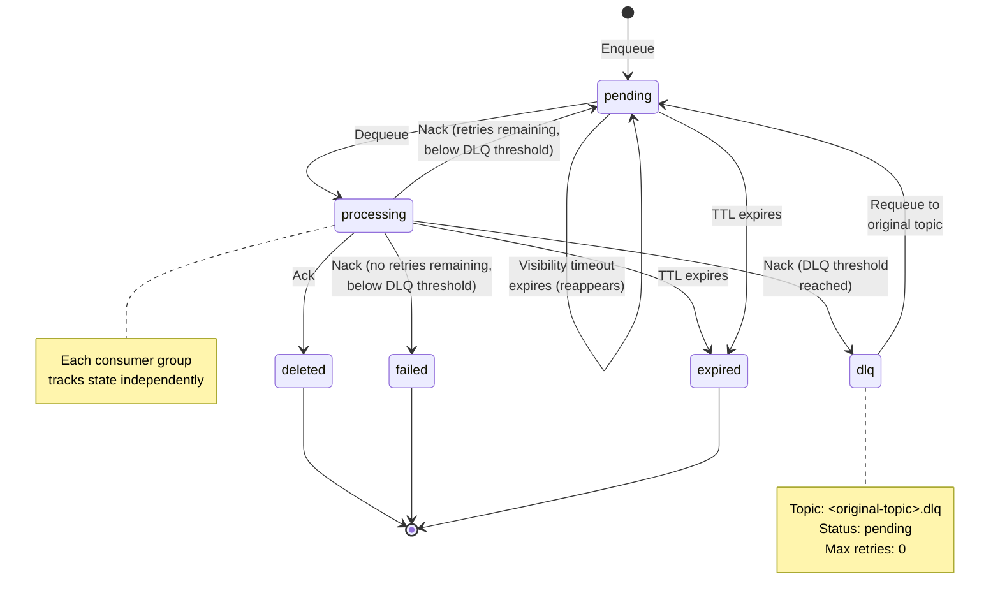

# queue-ti

A distributed message queue built on PostgreSQL, gRPC, and HTTP. No Kafka, Redis, or RabbitMQ — if you have Postgres, you have a production-ready queue.

queue-ti is designed for teams who want reliable, observable message processing without the operational overhead of a separate queue broker. It features built-in dead-letter queues, per-topic schema validation, JWT authentication with fine-grained grants, and a browser-based admin UI out of the box. Consumers and producers connect via high-performance gRPC; operators manage the queue through a REST API and Angular dashboard.

## Why queue-ti?

- **PostgreSQL only** — No additional infrastructure. If you run Postgres already, queue-ti is a drop-in message queue with one table.
- **At-least-once delivery** — Messages are never lost. Visibility timeouts ensure unacked messages are retried. Dead-letter queue automatically contains exhausted messages for manual inspection and requeue.
- **Built for observability** — Prometheus metrics out of the box (`/metrics`); live queue depth via REST API; admin UI shows message status, retry counts, and expiry times.
- **High performance** — gRPC protocol with `FOR UPDATE SKIP LOCKED` dequeue. Throughput tested at 1500+ ops/sec per consumer.
- **Admin UI included** — Inspect messages, manually enqueue test data, requeue from DLQ, manage topics and users—all without writing code. OAuth-ready JWT auth.
- **Brute-force protection** — Login rate limiting (10 requests per 60-second window per IP) backed by Redis for multi-replica deployments, in-memory for single-instance setups.
- **Per-topic configuration** — Override retry limits, TTLs, and queue depth per topic at runtime without restart.
- **Avro schema validation** — Optional per-topic schemas enforce payload contracts at enqueue time.
- **Go, Node.js, and Python client libraries** — Drop-in Producer/Consumer with auto-reconnect, token refresh, and zero boilerplate.

## Features

- **gRPC API** — High-performance queue operations (enqueue, dequeue, acknowledge, nack) over gRPC
- **HTTP Admin API** — REST endpoints for queue inspection, management, user/grant administration, and schema configuration
- **Topic-based routing** — Multiple independent queues share a single PostgreSQL table, partitioned by topic
- **Message keys** — Optional deduplication keys allow upsert semantics—enqueuing with the same key updates the pending message rather than creating a duplicate
- **Automatic retries** — Failed messages are automatically retried up to a configurable limit; consumers call `Nack` to signal failure
- **Dead-letter queue** — Messages that exhaust their retry limit are automatically promoted to `<topic>.dlq`; can be manually requeued to the original topic
- **Message TTL** — Messages expire after a configurable duration; an automatic reaper marks expired messages
- **Contention-free dequeue** — Uses `FOR UPDATE SKIP LOCKED` for lock-free concurrent consumption
- **JWT authentication** — Optional JWT-based auth (HS256) with user accounts, role-based access, and per-topic grants
- **Avro schema validation** — Optional per-topic Avro schema registration; payloads validated at enqueue time
- **Per-topic configuration** — Override retry count, TTL, queue depth limits, and throughput caps per topic via HTTP API or admin UI
- **Throughput throttling** — Optional per-topic message rate limits (messages/second) enforced at dequeue time using PostgreSQL token-bucket algorithm
- **Admin UI** — Angular web interface for message inspection, manual enqueue, DLQ requeue, and topic management
- **Prometheus metrics** — Real-time counters and gauges (`/metrics` endpoint, unauthenticated)
- **Client libraries** — Go, Node.js, and Python with async-first design, auto-reconnection, and token refresh

## Table of Contents

- [Quick Start](#quick-start)
- [Client Libraries](#client-libraries)
- [Configuration](#configuration)
- [Login Rate Limiting](#login-rate-limiting)
- [Authentication & User Management](#authentication--user-management)
- [Avro Schema Validation](#avro-schema-validation)
- [Consumer Groups](#consumer-groups)
- [Queue Mechanics](#queue-mechanics)
- [Message Lifecycle](#message-lifecycle)
- [Architecture](#architecture)
- [API Reference](#api-reference)
- [Observability](#observability)
- [Running Tests](#running-tests)
- [Performance Testing](#performance-testing)
- [Development Workflow](#development-workflow)
- [Project Structure](#project-structure)
- [Deployment](#deployment)
- [Internal Event Broadcasting](#internal-event-broadcasting)
- [Release Management](#release-management)
- [Troubleshooting](#troubleshooting)
- [Contributing](#contributing)
- [License](#license)

## Quick Start

### Prerequisites

- Go 1.25.5 or later
- PostgreSQL 16+
- Node.js 20+ (for admin UI development)
- Docker and Docker Compose (optional, for containerized deployment)

### Local Development

1. **Clone the repository**
   ```bash
   git clone https://github.com/Joessst-Dev/queue-ti
   cd queue-ti
   ```

2. **Set up PostgreSQL**
   ```bash
   # Using Docker
   docker run --rm -d \
     --name queueti-postgres \
     -e POSTGRES_DB=queueti \
     -e POSTGRES_USER=postgres \
     -e POSTGRES_PASSWORD=postgres \
     -p 5432:5432 \
     postgres:16-alpine

   # Wait for health check
   docker exec queueti-postgres pg_isready -U postgres
   ```

3. **Start the backend server**
   ```bash
   make run
   ```
   The server listens on:
   - **gRPC**: `localhost:50051` (for queue producers/consumers)
   - **HTTP**: `localhost:8080` (for admin UI and REST API)

4. **Start the admin UI** (in another terminal)
   ```bash
   cd admin-ui
   npm install
   npx nx serve
   ```
   The UI is available at `http://localhost:4200`

5. **Clean up**
   ```bash
   docker stop queueti-postgres
   ```

### Docker Compose

Deploy the full stack (PostgreSQL + backend + admin UI) with one command:

```bash
docker-compose up
```

The admin UI is available at `http://localhost:8081` (login: `admin` / `secret`).

## Client Libraries

queue-ti provides official client libraries for Go, Node.js, and Python.

### Go

The `clients/go/` package provides a high-level Producer/Consumer API for building applications that enqueue and dequeue messages from queue-ti's gRPC service.

#### Single-Message Consumer

```go
// Connect — token refreshes automatically before expiry
c, _ := queueti.Dial("localhost:50051",
    queueti.WithInsecure(),
    queueti.WithBearerToken(initialToken),
    queueti.WithTokenRefresher(fetchFreshToken),
)
defer c.Close()

// Publish
producer := c.NewProducer()
id, _ := producer.Publish(ctx, "orders", []byte(`{"amount":99}`))

// Publish with a deduplication key (upserts pending messages with same key)
id, _ := producer.Publish(ctx, "orders", []byte(`{"amount":99}`), 
    queueti.WithKey("order-123"),
)

// Consume (blocks until ctx cancelled)
consumer := c.NewConsumer("orders", queueti.WithConcurrency(4))
consumer.Consume(ctx, func(ctx context.Context, msg *queueti.Message) error {
    fmt.Println(string(msg.Payload))
    return nil // nil = Ack, error = Nack
})
```

#### Batch Consumer

For high-throughput scenarios, use batch dequeue to consume multiple messages in a single RPC call:

```go
c, _ := queueti.Dial("localhost:50051",
    queueti.WithInsecure(),
    queueti.WithBearerToken(initialToken),
)
defer c.Close()

consumer := c.NewConsumer("orders", queueti.WithConcurrency(4))

// ConsumeBatch dequeues up to batchSize messages and calls handler once
// with all messages. Each message has individual Ack() and Nack() closures.
consumer.ConsumeBatch(ctx, 10, func(ctx context.Context, messages []*queueti.BatchMessage) error {
    for _, msg := range messages {
        if err := processOrder(msg.Payload); err != nil {
            msg.Nack("processing failed: " + err.Error())
            continue
        }
        msg.Ack()
    }
    return nil // Handler return value is for fatal errors; individual messages use Ack/Nack
})
```

**BatchMessage** fields and methods:
- `Payload` ([]byte) — Message content
- `Metadata` (map[string]string) — Message metadata
- `CreatedAt` (time.Time) — Enqueue timestamp
- `RetryCount` (int) — Current retry count
- `MaxRetries` (int) — Maximum retries allowed
- `Ack()` — Acknowledge the message (removes it from the queue)
- `Nack(reason string)` — Nack the message (optionally with error reason); triggers retry or DLQ promotion

**ConsumeBatch behavior**:
- Dequeues up to `batchSize` messages (1–1000) in a single gRPC call
- Returns immediately with available messages (0 to batchSize); never blocks waiting for more
- Each message in the batch is individually locked and can be acked or nacked independently
- Auto-reconnect and token refresh work the same as single-message `Consume`

See [clients/go/README.md](clients/go/README.md) for the full API reference, authentication setup, error handling, and examples.

### Node.js

The `@queue-ti/client` npm package provides TypeScript-first Producer/Consumer APIs for Node.js applications. It connects via gRPC with automatic token refresh, graceful reconnection, and batch consumption support.

**Quick Producer Example:**

```typescript
import { connect } from '@queue-ti/client'

const client = await connect('localhost:50051', { insecure: true })
const producer = client.producer()

const id = await producer.publish('orders', Buffer.from(JSON.stringify({ amount: 99.99 })), {
  metadata: { source: 'checkout' },
})
console.log('published:', id)
client.close()
```

**Quick Consumer Example:**

```typescript
const consumer = client.consumer('orders', { concurrency: 4 })
const signal = AbortSignal.timeout(60_000)

await consumer.consume(async (msg) => {
  console.log(`[${msg.id}] ${msg.payload.toString()}`)
  // Return normally to Ack; throw to Nack
})
```

See [clients/node/README.md](clients/node/README.md) for the full API reference, authentication setup, error handling, and examples.

### Python

The `queue-ti-client` PyPI package provides async-first Producer/Consumer APIs for Python 3.11+ applications. It features automatic token refresh, graceful reconnection, and batch consumption, with both async and synchronous wrapper interfaces.

**Installation:**

```bash
pip install queue-ti-client
```

**Quick Async Producer Example:**

```python
import asyncio
from queueti import connect, ConnectOptions

async def main():
    client = await connect(
        "localhost:50051",
        options=ConnectOptions(insecure=True),
    )
    producer = client.producer()
    
    msg_id = await producer.publish(
        "orders",
        b'{"amount": 99.99}',
    )
    print(f"Published: {msg_id}")
    await client.close()

asyncio.run(main())
```

**Quick Async Consumer Example:**

```python
import asyncio
from queueti import connect, ConnectOptions, ConsumerOptions

async def main():
    client = await connect(
        "localhost:50051",
        options=ConnectOptions(insecure=True),
    )
    consumer = client.consumer(
        "orders",
        options=ConsumerOptions(concurrency=4),
    )
    
    async def handle(msg):
        print(f"[{msg.id}] {msg.payload.decode()}")
        # Return normally to auto-ack; raise to auto-nack
    
    await consumer.consume(handle)

asyncio.run(main())
```

**Synchronous API:**

For sync-only applications, use `connect_sync()` which runs async operations on a background thread:

```python
from queueti import connect_sync, ConnectOptions

client = connect_sync(
    "localhost:50051",
    options=ConnectOptions(insecure=True),
)
producer = client.producer()
msg_id = producer.publish("orders", b'{"amount": 99.99}')
print(f"Published: {msg_id}")
client.close()
```

See [clients/python/README.md](clients/python/README.md) for the full API reference, authentication setup, error handling, and examples.

## Configuration

Configuration is loaded from `config.yaml` at the repository root. All keys can be overridden with environment variables prefixed `QUEUETI_`.

### Configuration File

Create or edit `config.yaml`:

```yaml
server:
  port: 50051          # gRPC server port
  http_port: 8080      # HTTP admin API port

db:
  host: localhost
  port: 5432
  user: postgres
  password: postgres
  name: queueti
  sslmode: disable     # Options: disable, require, verify-ca, verify-full

queue:
  visibility_timeout: 30s       # Time a dequeued message remains invisible to other consumers
  max_retries: 3                # Maximum number of retries for a failed message
  message_ttl: 24h              # Time-to-live for messages (0 = no expiry)
  dlq_threshold: 3              # Retry count at which messages are promoted to DLQ (0 = disabled)
  require_topic_registration: false  # Require explicit topic registration before enqueue (default: false)
  delete_reaper_schedule: ""    # Cron schedule for automatic expired message deletion (empty = disabled)

auth:
  enabled: false
  username: admin
  password: secret

log_level: info         # Log level: debug, info, warn, error (default: info)

# redis:
#   host: ""            # Redis host for login rate limiter (empty = in-memory, disabled by default)
#   port: 6379          # Redis port
#   password: ""        # Redis AUTH password (optional, but required in production)
#   tls_enabled: false  # Enable TLS for Redis connections
```

### Environment Variables

Any configuration key can be overridden with an environment variable using the key path with underscores and the `QUEUETI_` prefix:

| Variable | Description | Example |
|----------|-------------|---------|
| `QUEUETI_SERVER_PORT` | gRPC port | `50051` |
| `QUEUETI_SERVER_HTTP_PORT` | HTTP port | `8080` |
| `QUEUETI_DB_HOST` | PostgreSQL host | `localhost` |
| `QUEUETI_DB_PORT` | PostgreSQL port | `5432` |
| `QUEUETI_DB_USER` | PostgreSQL user | `postgres` |
| `QUEUETI_DB_PASSWORD` | PostgreSQL password | `postgres` |
| `QUEUETI_DB_NAME` | PostgreSQL database | `queueti` |
| `QUEUETI_DB_SSLMODE` | PostgreSQL SSL mode | `disable` |
| `QUEUETI_QUEUE_VISIBILITY_TIMEOUT` | Visibility timeout | `30s` |
| `QUEUETI_QUEUE_MAX_RETRIES` | Max retry count per message | `3` |
| `QUEUETI_QUEUE_MESSAGE_TTL` | Message time-to-live (0 = no expiry) | `24h` |
| `QUEUETI_QUEUE_DLQ_THRESHOLD` | Retry count for DLQ promotion (0 = disabled) | `3` |
| `QUEUETI_QUEUE_REQUIRE_TOPIC_REGISTRATION` | Require topics to be registered before enqueue | `false` |
| `QUEUETI_QUEUE_DELETE_REAPER_SCHEDULE` | Cron schedule for automatic expired message deletion (empty = disabled) | (empty) |
| `QUEUETI_AUTH_ENABLED` | Enable JWT authentication | `true` |
| `QUEUETI_AUTH_JWT_SECRET` | JWT signing secret (required if auth enabled) | (any string) |
| `QUEUETI_AUTH_USERNAME` | Default admin username | `admin` |
| `QUEUETI_AUTH_PASSWORD` | Default admin password | `secret` |
| `QUEUETI_LOG_LEVEL` | Log level (debug, info, warn, error) | `info` |
| `QUEUETI_REDIS_HOST` | Redis host for login rate limiter (empty = in-memory; default: empty) | `` |
| `QUEUETI_REDIS_PORT` | Redis port | `6379` |
| `QUEUETI_REDIS_PASSWORD` | Redis AUTH password (optional, but recommended in production) | `` |
| `QUEUETI_REDIS_TLS_ENABLED` | Enable TLS for Redis connections | `false` |

### Log Levels

The `log_level` configuration controls the verbosity of server logging:

| Level | Use Case | Typical Output |
|-------|----------|-----------------|
| **debug** | Local development, detailed message tracing | Per-message operations (enqueue, dequeue, ack, nack-retry), HTTP requests |
| **info** | Production (default) | Server startup, DLQ promotions, requeue operations, expiry reaper results, auth enabled notice |
| **warn** | Production monitoring | Authentication failures, DLQ threshold misconfiguration |
| **error** | Production incidents | Unexpected DB failures, server errors |

Set via environment variable:
```bash
QUEUETI_LOG_LEVEL=debug
```

Or in `config.yaml`:
```yaml
log_level: debug
```

The resolved log level is printed at server startup.

### Per-Topic Configuration

Individual topics can override the global queue settings. This is useful when certain topics require stricter retry limits, longer TTLs, queue depth constraints, or rate limiting.

**Supported overrides:**
- `max_retries` — Maximum retry count for messages on this topic (overrides global `max_retries`)
- `message_ttl_seconds` — Time-to-live for messages in seconds (overrides global `message_ttl`); set to `0` to disable TTL for this topic
- `max_depth` — Maximum number of pending+processing messages allowed on this topic; set to `null` or `0` for unlimited; `Enqueue` returns HTTP 429 when the topic reaches capacity
- `throughput_limit` — Maximum messages per second allowed to be dequeued from this topic; set to `null` or `0` for unlimited; when exhausted, dequeue returns fewer messages than requested (soft limiting, not an error)

**Precedence:** Per-topic overrides take priority over global defaults. Omitting a field (or sending `null`) reverts that setting to the global default.

**Set per-topic configuration:**

```bash
curl -u admin:secret -X PUT http://localhost:8080/api/topic-configs/orders \
  -H "Content-Type: application/json" \
  -d '{
    "max_retries": 5,
    "message_ttl_seconds": 3600,
    "max_depth": 1000,
    "throughput_limit": 100
  }'
```

Response:
```json
{
  "topic": "orders",
  "max_retries": 5,
  "message_ttl_seconds": 3600,
  "max_depth": 1000,
  "throughput_limit": 100
}
```

**Clear an override to return to global default:**

```bash
curl -u admin:secret -X PUT http://localhost:8080/api/topic-configs/orders \
  -H "Content-Type: application/json" \
  -d '{"max_retries": null}'
```

Topics ending in `.dlq` (dead-letter queue topics) cannot have configurations set; the API returns HTTP 400 if you attempt to configure a DLQ topic.

The admin UI **Config** tab allows interactive viewing and editing of all topic configurations without server restart.

### Topic Registration

By default, queue-ti allows messages to be enqueued to any topic without prior registration. This is convenient for development but can be risky in production—typos in topic names create silent, unrecoverable message loss.

To require explicit topic registration, enable the `require_topic_registration` flag:

```yaml
queue:
  require_topic_registration: true
```

Or via environment variable:
```bash
QUEUETI_QUEUE_REQUIRE_TOPIC_REGISTRATION=true
```

**Behavior when registration is required:**
- Enqueue requests to unregistered topics are rejected with HTTP 422 (gRPC `FailedPrecondition`)
- Topics are registered by creating a configuration entry via `PUT /api/topic-configs/:topic`
- The admin UI **New Topic** button (in the Topics section) simplifies registration; when enabled, admins must register a topic before producers can enqueue to it
- The empty-state message in the admin UI changes to: "No topics registered. Use 'New Topic' to register a topic before messages can be enqueued to it."

**Example: Register a topic and enqueue a message**

```bash
# Register the topic
curl -u admin:secret -X PUT http://localhost:8080/api/topic-configs/orders \
  -H "Content-Type: application/json" \
  -d '{}'

# Now enqueue is allowed
curl -X POST http://localhost:8080/api/messages \
  -H "Content-Type: application/json" \
  -d '{"topic": "orders", "payload": "eyJvcmRlcl9pZCI6IDEyMzQ1fQ=="}'
```

**When to enable registration:**
- Production deployments where topic names are fixed and controlled
- Microservices architectures with schema registries (topics are registered alongside schemas)
- Teams that want producer errors on typos rather than silent failures

## Login Rate Limiting

### Overview

The login endpoint (`POST /api/auth/login`) is protected by a rate limiter that prevents brute-force authentication attacks. By default, the rate limiter uses in-memory storage. For multi-replica deployments, configure Redis to share rate-limit state across all backend instances.

**Default behavior (in-memory):**
- Rate limit: 10 requests per 60-second window per client IP
- Storage: In-memory; each instance has its own rate-limit counter
- Suitable for: Single-instance deployments, development, testing

**With Redis (shared state):**
- Rate limit: 10 requests per 60-second window per client IP (same limit, shared across instances)
- Storage: Redis; all backend instances query the same counter
- Suitable for: Multi-replica deployments, load-balanced production setups

### Enabling Redis Rate Limiter

To enable Redis-backed rate limiting, set the `redis.host` configuration:

```yaml
redis:
  host: redis.example.com  # Non-empty host enables Redis
  port: 6379
  password: ""             # Optional, but recommended for production
  tls_enabled: false       # Enable TLS for secure Redis connections
```

Or use environment variables:
```bash
QUEUETI_REDIS_HOST=redis.example.com
QUEUETI_REDIS_PORT=6379
QUEUETI_REDIS_PASSWORD=your-redis-password
QUEUETI_REDIS_TLS_ENABLED=true
```

When `QUEUETI_REDIS_HOST` is empty or unset, the rate limiter falls back to in-memory storage automatically.

### Redis Connection

- **Startup validation**: The server pings Redis at startup to verify reachability. If the ping fails, the server logs an error and exits.
- **Client IP detection**: The rate limiter uses the `X-Real-IP` header (set by reverse proxies like Nginx) to identify the client. Ensure your proxy sets this header correctly.
- **Key isolation**: Rate-limit keys include the client IP to prevent one user's failed login attempts from blocking others.

### Example: Docker Compose with Redis

The `docker-compose.redis.yaml` overlay adds a Redis service and configures the backend to use it:

```bash
# Start with Redis
docker-compose -f docker-compose.yaml -f docker-compose.redis.yaml up -d

# Or use the convenient make target
make up-redis
```

This runs:
- PostgreSQL (as usual)
- Redis (7-alpine) bound to `127.0.0.1:6379`
- Backend (with `QUEUETI_REDIS_HOST=redis`, `QUEUETI_REDIS_PORT=6379`)
- Admin UI (as usual)

To stop all services:
```bash
make down
```

### Multi-Replica Deployments

In production with multiple backend replicas behind a load balancer:

1. **Configure Redis** to a shared instance (e.g., an AWS ElastiCache, Google Cloud Memorystore, or self-hosted Redis cluster)
2. **Set Redis credentials** via `QUEUETI_REDIS_PASSWORD` and optionally `QUEUETI_REDIS_TLS_ENABLED`
3. **Deploy replicas** — each instance connects to the same Redis and shares rate-limit state
4. **Security note**: Bind your Redis instance to a private network or use authentication and TLS (`QUEUETI_REDIS_TLS_ENABLED=true`) in production

## Internal Event Broadcasting

queue-ti uses an internal event broadcast system to maintain cache coherence across multiple backend instances. When a topic schema or configuration is mutated via the HTTP API, a notification is published so all running instances can invalidate their in-memory caches, preventing stale data from being served.

### Broadcast Channels

| Channel | Trigger | Effect |
|---------|---------|--------|
| `queue_ti_schema_changed` | Topic Avro schema is created, updated, or deleted via `PUT /api/topic-schemas/:topic` or `DELETE /api/topic-schemas/:topic` | All instances delete the topic from `globalSchemaCache`, forcing the next enqueue to re-fetch from the database |
| `queue_ti_config_changed` | Topic configuration is created, updated, or deleted via `PUT /api/topic-configs/:topic` or `DELETE /api/topic-configs/:topic` | Currently logged for observability; reserved for future in-memory config cache invalidation |

### Implementation

The broadcaster system is pluggable via the `Broadcaster` interface in `internal/broadcast/`:

- **PostgreSQL implementation** (`broadcast.NewPG(pool)`) — Uses `LISTEN`/`NOTIFY` on a dedicated database connection. Messages are published with `pg_notify(channel, payload)` and subscribers receive them via a channel-based listener.
- **Noop implementation** (`broadcast.Noop`) — Default, used for single-instance deployments. Satisfies the interface but publishes nothing.
- **Future Redis implementation** — When Redis support is added, a Redis pub/sub implementation will replace the PostgreSQL broadcaster, maintaining the same `Broadcaster` interface.

### Sequence Diagram



### Startup

At server startup, the queue service registers the broadcaster and starts background listeners:

```go
broadcaster := broadcast.NewPG(pool)
queueService.UseBroadcaster(ctx, broadcaster)
```

This call sets the broadcaster instance and immediately starts two background goroutines listening on `queue_ti_schema_changed` and `queue_ti_config_changed`. Listeners exit cleanly when `ctx` is cancelled (during graceful shutdown).

## Authentication & User Management

queue-ti supports JWT-based authentication with per-user grants to enforce granular access control. User accounts and role assignments are managed via the admin UI or REST API.

### Enabling Authentication

Authentication is disabled by default. To enable it, set:

```yaml
auth:
  enabled: true
  jwt_secret: "your-secret-key-here"
```

Or use environment variables:
```bash
QUEUETI_AUTH_ENABLED=true
QUEUETI_AUTH_JWT_SECRET="your-secret-key-here"
```

The server will fail to start if `auth.enabled=true` and `jwt_secret` is empty.

### Default Admin User

On first startup, the server automatically seeds a default admin user from the configuration:

```yaml
auth:
  enabled: true
  jwt_secret: "your-secret-key-here"
  username: admin          # Becomes the first admin account username
  password: secret         # Becomes the first admin account password
```

After the server starts, the default user is created (if it doesn't already exist) with `is_admin=true`. You can change the password and create additional users via the admin UI **Users** tab.

### User Roles and Permissions

#### Admin Flag

The `is_admin` flag grants a user unrestricted access:
- **Admin users** (`is_admin=true`) bypass all per-topic grant checks and can access all queue operations and admin endpoints
- **Regular users** (`is_admin=false`) are subject to per-topic grants

#### Per-Topic Grants

Regular users require explicit grants for each action and topic. A grant specifies:
- **Action**: one of `read`, `write`, or `admin`
- **Topic Pattern**: one of the following:
  - `*` — All topics (wildcard grant)
  - `orders.*` — Prefix glob (e.g., matches `orders`, `orders.dlq`, `orders.v1`, etc.)
  - `orders` — Exact topic name

**Grant semantics:**
- `read` — Allows `GET /api/messages` and `GET /api/stats` for this topic
- `write` — Allows `POST /api/messages`, `POST /api/messages/:id/ack`, `POST /api/messages/:id/nack`, `POST /api/messages/:id/requeue` for this topic; also required for gRPC `Dequeue` calls. Note: `write` alone does not restrict which consumer groups are accessible.
- `admin` — Allows topic configuration and schema management (`GET/PUT/DELETE /api/topic-configs/:topic`, `GET/PUT/DELETE /api/topic-schemas/:topic`) for this topic
- `consume` — Restricts the user to a specific named consumer group on the topic. See **Consumer Group Grants** below.

**Example grants:**

| Username | Grant | Topic Pattern | Consumer Group | Interpretation |
|----------|-------|---------------|----------------|-----------------|
| `alice` | `write` | `orders` | — | Can enqueue, dequeue, ack, and nack messages in `orders` (no group restriction) |
| `bob` | `read` | `*` | — | Can list and inspect all messages across all topics |
| `charlie` | `admin` | `payments.*` | — | Can manage configuration for topics matching `payments.*` |
| `diana` | `consume` | `orders.*` | `warehouse` | Can only dequeue/ack/nack in `orders.*` topics when using consumer group `warehouse` |

### Consumer Group Grants

Consumer group grants let you restrict a user to a specific named consumer group on a topic. This is useful when multiple teams consume from the same topic and you want to enforce that each team only processes its own group.

**Semantics:**
- A user with no `consume` grants for a topic can consume from any group (unrestricted).
- Once any `consume` grant exists for a user+topic, that user is restricted to only the explicitly granted groups.
- A user can hold multiple `consume` grants for the same topic with different groups to allow access to more than one.
- A `write` grant alone does not restrict groups. If a user has both `write` and `consume` grants for a topic, the `consume` grant restrictions apply.

**Creating a consumer group grant via REST:**

```bash
curl -X POST -H "Authorization: Bearer <admin-token>" \
  -H "Content-Type: application/json" \
  -d '{"topic_pattern": "orders.*", "consumer_group": "warehouse"}' \
  http://localhost:8080/api/users/550e8400-e29b-41d4-a716-446655440000/consumer-group-grants
```

Omitting `topic_pattern` defaults to `"*"` (all topics).

**Response:** HTTP 201 Created
```json
{
  "id": "...",
  "user_id": "...",
  "action": "consume",
  "topic_pattern": "orders.*",
  "consumer_group": "warehouse",
  "created_at": "2025-01-15T12:00:00Z"
}
```

Consumer group grants can be deleted via the existing `DELETE /api/users/:id/grants/:grant_id` endpoint.

### JWT Token Details

- **Token lifetime**: 15 minutes
- **Algorithm**: HS256 (HMAC with SHA-256)
- **Claims**:
  - `uid` — User UUID
  - `sub` — Username
  - `adm` — Boolean indicating if user is admin
  - `iat` — Issued at (standard)
  - `exp` — Expiration time (standard)

### Authentication Endpoints

#### POST /api/auth/login

Authenticates a user and returns a JWT token.

**Request:**
```bash
curl -X POST http://localhost:8080/api/auth/login \
  -H "Content-Type: application/json" \
  -d '{"username": "admin", "password": "secret"}'
```

**Response:** HTTP 200 OK
```json
{"token": "eyJhbGciOiJIUzI1NiIsInR5cCI6IkpXVCJ9..."}
```

#### POST /api/auth/refresh

Refreshes an existing JWT token.

**Request:**
```bash
curl -X POST http://localhost:8080/api/auth/refresh \
  -H "Authorization: Bearer <token>"
```

**Response:** HTTP 200 OK with a new token
```json
{"token": "eyJhbGciOiJIUzI1NiIsInR5cCI6IkpXVCJ9..."}
```

#### GET /api/auth/status

Returns the current authentication status and the authenticated user.

**Request:**
```bash
curl http://localhost:8080/api/auth/status
```

**Response:** HTTP 200 OK
```json
{
  "auth_required": true,
  "user": {
    "id": "550e8400-e29b-41d4-a716-446655440000",
    "username": "admin",
    "is_admin": true
  }
}
```

### User Management Endpoints (Admin-Only)

All user and grant management endpoints require `is_admin=true`.

#### GET /api/users

Lists all user accounts.

```bash
curl -H "Authorization: Bearer <token>" http://localhost:8080/api/users
```

**Response:**
```json
{
  "users": [
    {"id": "550e8400...", "username": "admin", "is_admin": true, "created_at": "2025-04-25T12:00:00Z"},
    {"id": "660e8400...", "username": "alice", "is_admin": false, "created_at": "2025-04-25T12:05:00Z"}
  ]
}
```

#### POST /api/users

Creates a new user account.

```bash
curl -X POST -H "Authorization: Bearer <token>" \
  -H "Content-Type: application/json" \
  -d '{"username": "bob", "password": "secure-password", "is_admin": false}' \
  http://localhost:8080/api/users
```

**Response:** HTTP 201 Created
```json
{"id": "770e8400...", "username": "bob", "is_admin": false, "created_at": "2025-04-25T12:10:00Z"}
```

#### PUT /api/users/:id

Updates a user account (username, password, and/or admin flag).

```bash
curl -X PUT -H "Authorization: Bearer <token>" \
  -H "Content-Type: application/json" \
  -d '{"is_admin": true}' \
  http://localhost:8080/api/users/770e8400-e29b-41d4-a716-446655440002
```

**Response:** HTTP 200 OK with the updated user

#### DELETE /api/users/:id

Deletes a user account.

```bash
curl -X DELETE -H "Authorization: Bearer <token>" \
  http://localhost:8080/api/users/770e8400-e29b-41d4-a716-446655440002
```

**Response:** HTTP 204 No Content

### Grant Management Endpoints (Admin-Only)

#### GET /api/users/:id/grants

Lists all grants for a specific user.

```bash
curl -H "Authorization: Bearer <token>" \
  http://localhost:8080/api/users/550e8400-e29b-41d4-a716-446655440000/grants
```

**Response:**
```json
{
  "grants": [
    {
      "id": "880e8400...",
      "user_id": "550e8400...",
      "action": "write",
      "topic_pattern": "orders",
      "created_at": "2025-04-25T12:00:00Z"
    },
    {
      "id": "991e8400...",
      "user_id": "550e8400...",
      "action": "consume",
      "topic_pattern": "orders.*",
      "consumer_group": "warehouse",
      "created_at": "2025-04-25T12:01:00Z"
    }
  ]
}
```

#### POST /api/users/:id/grants

Creates a new grant for a user.

```bash
curl -X POST -H "Authorization: Bearer <token>" \
  -H "Content-Type: application/json" \
  -d '{"action": "write", "topic_pattern": "payments.*"}' \
  http://localhost:8080/api/users/550e8400-e29b-41d4-a716-446655440000/grants
```

**Response:** HTTP 201 Created

#### DELETE /api/users/:id/grants/:grant_id

Deletes a specific grant.

```bash
curl -X DELETE -H "Authorization: Bearer <token>" \
  http://localhost:8080/api/users/550e8400-e29b-41d4-a716-446655440000/grants/880e8400-e29b-41d4-a716-446655440003
```

**Response:** HTTP 204 No Content

#### POST /api/users/:id/consumer-group-grants

Creates a `consume` grant that restricts the user to a specific consumer group on a topic. Requires admin.

```bash
curl -X POST -H "Authorization: Bearer <admin-token>" \
  -H "Content-Type: application/json" \
  -d '{"topic_pattern": "orders.*", "consumer_group": "warehouse"}' \
  http://localhost:8080/api/users/550e8400-e29b-41d4-a716-446655440000/consumer-group-grants
```

| Field | Required | Default | Description |
|-------|----------|---------|-------------|
| `consumer_group` | Yes | — | The consumer group the user is restricted to |
| `topic_pattern` | No | `*` | Topic pattern (`*`, `prefix.*`, or exact name) |

**Response:** HTTP 201 Created — returns the created grant object with `action: "consume"`.

Returns 400 if `consumer_group` is missing, 409 if the same user+topic+group combination already exists.

### Using JWT Tokens in HTTP Requests

After logging in, include the JWT token in the `Authorization: Bearer` header:

```bash
# Login to get token
TOKEN=$(curl -s -X POST http://localhost:8080/api/auth/login \
  -H "Content-Type: application/json" \
  -d '{"username": "admin", "password": "secret"}' | jq -r '.token')

# Use token for authenticated requests
curl -H "Authorization: Bearer $TOKEN" http://localhost:8080/api/messages
```

### Using JWT Tokens in gRPC Requests

For gRPC clients, include the JWT token in the `authorization` metadata header:

```go
import "google.golang.org/grpc/metadata"

// After login via HTTP to get the token
md := metadata.Pairs("authorization", "Bearer "+token)
ctx := metadata.NewOutgoingContext(context.Background(), md)

// Use ctx in gRPC calls
response, err := client.Enqueue(ctx, &pb.EnqueueRequest{...})
```

### Admin UI Authentication

The admin UI stores JWT tokens in `sessionStorage` after successful login. Tokens are automatically included in all HTTP requests via the auth interceptor.

**Login flow:**
1. User navigates to the login page
2. Enters username and password
3. Calls `POST /api/auth/login` with credentials
4. Token is stored in `sessionStorage`
5. User is redirected to the messages dashboard
6. Auth interceptor automatically adds `Authorization: Bearer <token>` to all subsequent requests

**Token expiration:**
- When a token expires (15 minutes), the next API request returns HTTP 401
- The admin UI prompts the user to log in again
- Users can manually refresh tokens via `POST /api/auth/refresh`

> **Security Note**: Never commit the JWT secret to version control. Use a `.env` file or a secrets management system (e.g., Docker secrets, Kubernetes secrets) in production.

## Avro Schema Validation

Topics can have an optional Avro schema registered. When a schema is registered for a topic, all `Enqueue` calls validate the JSON payload against that schema before storing the message. Topics without a registered schema accept any payload.

### How It Works

- **Schema registration**: Register an Avro schema for a topic via `PUT /api/topic-schemas/:topic`. The schema must be valid Avro JSON; invalid schemas are rejected with HTTP 400.
- **Validation at enqueue**: When a message is enqueued to a topic with a schema, the payload is validated as JSON and checked against the schema structure. If the payload does not conform, the enqueue fails with HTTP 422.
- **No schema = no validation**: Topics without a registered schema accept any payload. Existing messages are unaffected when a schema is added, updated, or removed.
- **Performance**: Parsed Avro schemas are cached in memory per topic. The cache automatically invalidates when a schema is updated or deleted.

### Validation Rules

For record schemas (the most common Avro type):
- Every required field (fields with no default value) must be present in the JSON payload
- Every present field must have a value compatible with its Avro type
- Optional fields (fields with a default value) may be omitted from the payload
- For other Avro types (primitives, arrays, maps, unions), the payload must be valid JSON and the top-level type must be compatible

### Schema Registration Endpoints

#### GET /api/topic-schemas

Lists all registered schemas.

```bash
curl -u admin:secret http://localhost:8080/api/topic-schemas
```

**Response:**
```json
{
  "items": [
    {
      "topic": "orders",
      "schema_json": "{\"type\":\"record\",\"name\":\"Order\",\"fields\":[{\"name\":\"id\",\"type\":\"int\"},{\"name\":\"total\",\"type\":\"float\"}]}",
      "version": 1,
      "updated_at": "2025-04-25T12:00:00Z"
    }
  ]
}
```

#### PUT /api/topic-schemas/:topic

Registers or updates an Avro schema for a topic. If a schema already exists, the version is incremented.

```bash
curl -u admin:secret -X PUT http://localhost:8080/api/topic-schemas/orders \
  -H "Content-Type: application/json" \
  -d '{
    "schema_json": "{\"type\":\"record\",\"name\":\"Order\",\"fields\":[{\"name\":\"order_id\",\"type\":\"int\"},{\"name\":\"customer_email\",\"type\":\"string\"},{\"name\":\"amount\",\"type\":\"double\"}]}"
  }'
```

**Response:** HTTP 200 OK

#### GET /api/topic-schemas/:topic

Fetches the schema registered for a specific topic.

```bash
curl -u admin:secret http://localhost:8080/api/topic-schemas/orders
```

**Response:** HTTP 200 OK or HTTP 404 if no schema is registered

#### DELETE /api/topic-schemas/:topic

Removes the registered schema for a topic. Existing messages are unaffected.

```bash
curl -u admin:secret -X DELETE http://localhost:8080/api/topic-schemas/orders
```

**Response:** HTTP 204 No Content

### Validation Errors

When a payload fails validation, the error includes details about what went wrong:

```json
{"error": "payload does not match topic schema: missing required field \"order_id\""}
```

Common validation error messages:
- `missing required field "fieldname"` — A required field is absent from the payload
- `field "fieldname": expected string, got number` — A field has the wrong JSON type
- `payload is not a valid JSON object` — The payload is not valid JSON or is not an object for a record schema

## System Architecture



**Architecture Overview:**

- **Frontend** (port 8081): Angular SPA served by Nginx, communicates exclusively with the HTTP API
- **Backend** (single Go process): Exposes two concurrent servers—gRPC (port 50051) for clients and HTTP (port 8080) for admin operations
- **Queue Service** (core): Shared by both servers; implements enqueue, dequeue, ack, nack, and administrative operations
- **Reapers**: Background goroutines that manage message lifecycle—expiry reaper marks old messages, delete reaper permanently removes them
- **PostgreSQL** (single table design): All messages stored in one table with composite indexes for efficient concurrent access

## Consumer Groups

Consumer groups enable independent consumption of the same messages by multiple systems. Without consumer groups, a single dequeue operation removes a message from a topic for all consumers. With consumer groups, each group independently tracks the processing state of every message, allowing the same message to be delivered and processed by multiple consumer systems in parallel.

**Key behaviors:**
- **Group independence** — Each group maintains its own delivery state for every message. Acking a message in one group does not affect other groups.
- **Parallel processing** — Multiple groups can process the same message concurrently without blocking each other.
- **Message lifecycle per group** — A message is deleted from the queue only when **all** registered groups have acknowledged it. If any group has not yet processed (or nacked) a message, it remains available.
- **Legacy mode** — When using the default consumer group (or no group specified in older client versions), queue-ti behaves as a single-consumer queue, maintaining backward compatibility.

### Registering a Consumer Group

Register a group via the HTTP admin API:

```bash
# Register a new group for a topic
curl -X POST http://localhost:8080/api/topics/orders/consumer-groups \
  -H "Content-Type: application/json" \
  -d '{"consumer_group": "warehouse"}'

# List all groups for a topic
curl http://localhost:8080/api/topics/orders/consumer-groups

# Unregister a group
curl -X DELETE http://localhost:8080/api/topics/orders/consumer-groups/warehouse
```

Once registered, a group automatically receives all pending messages that were enqueued before registration (backfill). Future messages are delivered to all registered groups.

### Using Consumer Groups in Client Libraries

#### Go Client

```go
consumer := client.NewConsumer("orders",
    queueti.WithConsumerGroup("warehouse"),
    queueti.WithConcurrency(4),
)

err := consumer.Consume(ctx, func(ctx context.Context, msg *queueti.Message) error {
    // Process message...
    return nil // Ack; return error to Nack
})
```

For batch consumption, `WithConsumerGroup` is set on `NewConsumer` — the consumer carries the group for all calls:

```go
consumer := client.NewConsumer("orders",
    queueti.WithConsumerGroup("warehouse"),
)

err := consumer.ConsumeBatch(ctx, "orders", 50,
    func(ctx context.Context, messages []*queueti.Message) error {
        for _, msg := range messages {
            // Process...
            msg.Ack(ctx)
        }
        return nil
    },
)
```

#### Node.js Client

```typescript
const consumer = client.consumer('orders', {
  consumerGroup: 'warehouse',
  concurrency: 4,
})

await consumer.consume(async (msg) => {
  // Process message...
  // Return normally to Ack; throw to Nack
})
```

For batch consumption:

```typescript
await consumer.consumeBatch(
  { batchSize: 50, consumerGroup: 'warehouse' },
  async (messages) => {
    for (const msg of messages) {
      // Process...
      await msg.ack()
    }
  },
)
```

#### Python Client

```python
import asyncio
from queueti import connect, ConnectOptions, ConsumerOptions

async def main():
    client = await connect("localhost:50051", options=ConnectOptions(insecure=True))
    consumer = client.consumer(
        "orders",
        options=ConsumerOptions(consumer_group="warehouse", concurrency=4),
    )
    
    async def handler(msg):
        # Process message...
        pass
    
    await consumer.consume(handler)

asyncio.run(main())
```

For batch consumption:

```python
from queueti import BatchOptions

async def handle_batch(messages):
    for msg in messages:
        # Process...
        await msg.ack()

await consumer.consume_batch(
    options=BatchOptions(batch_size=50, consumer_group="warehouse"),
    handler=handle_batch,
)
```

Sync variant:

```python
from queueti import connect_sync, ConnectOptions, ConsumerOptions

client = connect_sync("localhost:50051", options=ConnectOptions(insecure=True))
consumer = client.consumer(
    "orders",
    options=ConsumerOptions(consumer_group="warehouse"),
)

consumer.consume(handler)  # Blocks until interrupted
```

## Queue Mechanics

### Data Model

Messages are stored in a single `messages` PostgreSQL table with the following columns:

| Column | Type | Description |
|--------|------|-------------|
| `id` | UUID | Primary key |
| `topic` | TEXT | Topic name (required) |
| `payload` | BYTEA | Message payload (required) |
| `metadata` | JSONB | Optional metadata |
| `key` | TEXT | Optional deduplication key (nullable) |
| `status` | TEXT | One of `pending`, `processing`, `deleted`, `failed`, `expired` |
| `retry_count` | INTEGER | Number of times the message has been nacked |
| `max_retries` | INTEGER | Maximum retries allowed for this message |
| `last_error` | TEXT | Error message from most recent nack |
| `visibility_timeout` | TIMESTAMPTZ | When the message becomes visible again (null until dequeued) |
| `expires_at` | TIMESTAMPTZ | When the message expires (null if no TTL) |
| `original_topic` | TEXT | Original topic if this is a DLQ message; null otherwise |
| `dlq_moved_at` | TIMESTAMPTZ | When the message was promoted to DLQ; null otherwise |
| `created_at`, `updated_at` | TIMESTAMPTZ | Lifecycle timestamps |

**Indexes**: 
- Composite index on `(topic, status, visibility_timeout, created_at)` for efficient dequeue queries
- Unique partial index on `(topic, key)` where `key IS NOT NULL AND status = 'pending'` for key-based upserts

### Message Keys and Upsert Semantics

Messages can have an optional `key` field that enables deduplication and idempotent enqueue operations.

**Key behavior:**
- **Keyless messages** (`key = null`) always insert a new row; multiple enqueue calls produce multiple messages.
- **Keyed messages with no conflict** — A message with a key where no other pending message exists for that `(topic, key)` pair inserts a new row as usual.
- **Keyed messages with pending conflict** — If a pending message already exists for `(topic, key)`, the existing row is **upserted** in place: `payload`, `metadata`, and `updated_at` are replaced, the message ID remains the same, and no new row is created.
- **Keyed messages with processing conflict** — If the message is already being processed (`status = 'processing'`), it is **never upserted**. A best-effort insertion occurs instead, which may fail with a constraint violation. This prevents interrupting in-flight work. Retry the enqueue after the in-flight message completes.

**Use cases:**
- **Idempotent producers** — Safely replay enqueue calls without creating duplicate work
- **State synchronization** — Update a pending order with the latest customer information before a consumer picks it up
- **Request deduplication** — Associate one message per user request ID, replacing stale entries with new ones

**Example:**
```bash
# Enqueue with key
curl -X POST http://localhost:8080/api/messages \
  -H "Content-Type: application/json" \
  -d '{"topic": "orders", "key": "order-42", "payload": "eyJhbW91bnQiOjk5fQ=="}'

# Response (ID is "abc123")
{"id": "abc123"}

# Enqueue the same key with updated payload
curl -X POST http://localhost:8080/api/messages \
  -H "Content-Type: application/json" \
  -d '{"topic": "orders", "key": "order-42", "payload": "eyJhbW91bnQiOjEwMH0="}'

# Response returns the same ID (upserted, not duplicated)
{"id": "abc123"}
```

### Dequeue Algorithm

1. Query for the oldest pending message in the topic that is either not yet visible or has expired visibility, has not exceeded its retry limit, and has not expired by TTL.
2. Use `FOR UPDATE SKIP LOCKED` to prevent concurrent consumers from acquiring the same message.
3. Transition the message to `'processing'` status and set `visibility_timeout` to `now() + [visibility timeout duration]`.
   - The duration is determined by the optional `visibility_timeout_seconds` field in the `DequeueRequest` (if provided and > 0)
   - Otherwise, the server-wide `visibility_timeout` configuration is used
4. Return the message to the consumer.

### Per-Dequeue Visibility Timeout Override

Clients can override the server-wide visibility timeout on a per-dequeue basis by setting the optional `visibility_timeout_seconds` field in the `DequeueRequest`. This is useful for consumers with variable processing times. For example, a slow batch processor can request a longer timeout without changing the global config. When `visibility_timeout_seconds` is omitted or not set, the server-wide default applies. Setting it to 0 is rejected with an `InvalidArgument` error.

### Message Statuses

- **pending** (yellow badge) — Ready to be dequeued (initial state after enqueue, or reset after a nack with retries remaining, or after requeue from DLQ)
- **processing** (blue badge) — Currently held by a consumer (after dequeue, until ack or nack)
- **deleted** — Acknowledged by consumer; permanently removed from the queue
- **failed** (red badge) — Nacked with no retries remaining (only when DLQ threshold is disabled or message has not reached threshold)
- **expired** (orange badge) — Marked by the expiry reaper after TTL elapsed

### Message Lifecycle



**State Transitions:**

- **pending** → (dequeued) → **processing** → (acknowledged) → **deleted**
- **pending** → (dequeued) → **processing** → (nacked, retries remaining and below DLQ threshold) → **pending** (automatically retried)
- **pending** → (dequeued) → **processing** → (nacked, DLQ threshold reached) → moved to **<topic>.dlq** as **pending** (with max_retries = 0)
- **<topic>.dlq pending** → (manually requeued) → **pending** in original topic (resets retry_count and restores max_retries)
- **pending** or **processing** → (TTL expires) → **expired** (marked by automatic reaper)
- **pending** → (dequeued) → **processing** → (visibility timeout expires) → **pending** (automatically reappears)

**Consumer Group Behavior:**

When consumer groups are enabled, each group independently tracks delivery state for every message. A message transitions through pending/processing/deleted states per group. The message is only deleted from the queue when **all** registered groups have acknowledged it. If a group nacks a message, only that group's delivery state reverts to pending—other groups' states are unaffected.

### Dead-Letter Queue Details

When a message reaches the DLQ threshold, it is automatically promoted to a separate queue with the topic name `<original-topic>.dlq`. For example, messages from the `orders` topic that exceed the DLQ threshold are moved to `orders.dlq`.

In the DLQ topic:
- The message is stored with `status = 'pending'` and `max_retries = 0`, preventing automatic retries
- `original_topic` is set to the source topic (e.g., `orders`)
- `dlq_moved_at` is set to the promotion timestamp
- `retry_count` resets to 0

To reprocess a DLQ message, call the `POST /api/messages/:id/requeue` endpoint. This restores the message to its original topic with `retry_count = 0` and `max_retries` restored to the configured default, allowing it to be dequeued and processed again.

> **Note:** The DLQ topic name (`<topic>.dlq`) is reserved. Attempting to enqueue directly to a topic ending in `.dlq` returns an `ErrReservedTopic` error.

## Architecture

### Backend

The backend is a Go service with two concurrent servers:

```
cmd/server/main.go
├── gRPC Server (port 50051)
│   └── Handles queue operations (Enqueue, Dequeue, Ack, Nack)
│       └── Requires JWT auth if enabled
│
└── HTTP Server (port 8080)
    ├── /healthz                             GET    Health check
    ├── /api/auth/login                      POST   Authenticate user, return JWT token
    ├── /api/auth/refresh                    POST   Refresh JWT token
    ├── /api/auth/status                     GET    Authentication status
    ├── /api/messages                        GET    List messages (with optional topic filter)
    ├── /api/messages                        POST   Enqueue a message
    ├── /api/messages/dequeue                POST   Dequeue up to N messages from a topic
    ├── /api/messages/:id/nack               POST   Nack a processing message
    ├── /api/messages/:id/requeue            POST   Requeue a DLQ message
    ├── /api/topics/:topic/messages/by-key/:key  DELETE Delete all messages with a key (admin-only)
    ├── /api/stats                           GET    Queue depth statistics
    ├── /api/topic-configs                   GET    List all topic configurations
    ├── /api/topic-configs/:topic            PUT    Create/update topic configuration
    ├── /api/topic-configs/:topic            DELETE Delete topic configuration
    ├── /api/topic-schemas                   GET    List all registered schemas
    ├── /api/topic-schemas/:topic            PUT    Register or update a schema
    ├── /api/topic-schemas/:topic            DELETE Delete a registered schema
    ├── /api/topic-schemas/:topic            GET    Fetch a single schema
    ├── /api/topics/:topic/purge             POST   Purge messages from a topic (admin-only)
    ├── /api/admin/expiry-reaper/run         POST   Manually trigger expiry reaper (admin-only)
    ├── /api/admin/delete-reaper/run         POST   Manually trigger delete reaper (admin-only)
    ├── /api/users                           GET    List all users (admin-only)
    ├── /api/users                           POST   Create new user (admin-only)
    ├── /api/users/:id                       PUT    Update user (admin-only)
    ├── /api/users/:id                       DELETE Delete user (admin-only)
    ├── /api/users/:id/grants                GET    List user grants (admin-only)
    ├── /api/users/:id/grants                POST   Create grant for user (admin-only)
    ├── /api/users/:id/grants/:grant_id      DELETE Delete user grant (admin-only)
    ├── /metrics                             GET    Prometheus metrics (unauthenticated)
    └── /api/* endpoints require JWT auth if enabled; /metrics is unauthenticated
```

Both servers connect to the same `queue.Service` instance, which manages all message operations against PostgreSQL.

### Backend Layers

```
internal/
├── config/          Configuration loading (Viper YAML + env vars)
├── db/              PostgreSQL connectivity and migrations
├── queue/           Core queue logic (Service, Message types)
├── server/          gRPC and HTTP server implementations
├── auth/            JWT and basic auth handling
└── pb/              Generated protobuf Go bindings (read-only)
```

### Frontend

The admin UI is an Angular Single Page Application (Nx workspace) that communicates exclusively with the HTTP API on port 8080.

```
admin-ui/src/app/
├── services/
│   ├── queue.service.ts         HTTP client (GET /api/messages, POST /api/messages, POST /api/messages/:id/nack, POST /api/messages/:id/requeue)
│   └── auth.service.ts          Manages login state and credentials
├── interceptors/
│   └── auth.interceptor.ts      Injects Authorization header on all requests
├── guards/
│   └── auth.guard.ts            Protects routes; redirects to login if unauthorized
├── login/                        Authentication UI; stores credentials in localStorage
├── messages/                     Message list with status badges, retry/expiry columns, DLQ highlighting, and inline Nack/Requeue actions
└── services/                     Shared HTTP and auth services
```

**Admin UI Features**:
- **Message table** — Displays all messages with ID, topic, payload, status badge, retry count, expiry time, and metadata
- **Status badges** — Color-coded visual indicators: `pending` (yellow), `processing` (blue), `failed` (red), `expired` (orange)
- **Retry information** — Shows `retry_count / max_retries` with a tooltip displaying `last_error` when available
- **DLQ highlighting** — Dead-letter queue messages (`<topic>.dlq`) are highlighted with an amber background and show the original topic as a sub-label
- **Requeue action** — DLQ messages display a "Requeue" button to move them back to their original topic
- **Inline Nack** — Processing messages display a "Nack" button that expands an inline text input for an optional error reason
- **Topic filtering** — Filter the message list by topic name
- **Manual enqueue** — Form to enqueue test messages with topic, payload (JSON), and optional metadata key-value pairs
- **Config tab** — Interactive editor for per-topic configuration overrides without server restart

**Note**: The gRPC server (port 50051) is for queue client applications only; the UI uses HTTP exclusively.

## API Reference

### gRPC Service

The gRPC service implements the `QueueService` defined in `proto/queue.proto`. All methods require JWT auth if enabled.

#### Enqueue

Enqueues a message to a topic.

```protobuf
rpc Enqueue(EnqueueRequest) returns (EnqueueResponse);

message EnqueueRequest {
  string topic = 1;                    // Topic name (required)
  bytes payload = 2;                   // Message payload (required)
  map<string, string> metadata = 3;    // Optional metadata
  optional string key = 4;             // Optional deduplication key
}

message EnqueueResponse {
  string id = 1;  // UUID of the enqueued message
}
```

**Key behavior** — See [Message Keys and Upsert Semantics](#message-keys-and-upsert-semantics) for details on deduplication and upsert logic.

#### Dequeue

Dequeues the next available message from a topic.

```protobuf
rpc Dequeue(DequeueRequest) returns (DequeueResponse);

message DequeueRequest {
  string topic = 1;                           // Topic name (required)
  optional uint32 visibility_timeout_seconds = 2;  // Visibility timeout override (optional, > 0 if set)
}

message DequeueResponse {
  string id = 1;                        // Message UUID
  string topic = 2;                     // Topic name
  bytes payload = 3;                    // Message payload
  map<string, string> metadata = 4;     // Metadata
  google.protobuf.Timestamp created_at = 5;  // Creation timestamp
  int32 retry_count = 6;                // Current retry count
  int32 max_retries = 7;                // Maximum retries for this message
  optional string key = 8;              // Deduplication key (if present)
}
```

Returns `codes.NotFound` if no messages are available; otherwise returns the next message and transitions it to `'processing'` status with a visibility timeout.

**Visibility Timeout Behavior**:
- When `visibility_timeout_seconds` is **omitted or not set**, the server-wide `visibility_timeout` configuration is used (default 30 seconds).
- When `visibility_timeout_seconds` is **set to a value > 0**, that duration (in seconds) overrides the server-wide configuration for this dequeue operation only.
- When `visibility_timeout_seconds` is **set to 0**, the request is rejected with `codes.InvalidArgument`.

#### BatchDequeue

Dequeues up to N messages from a topic in a single round-trip. Returns immediately with however many messages are available (0 to N); never blocks waiting for messages.

```protobuf
rpc BatchDequeue(BatchDequeueRequest) returns (BatchDequeueResponse);

message BatchDequeueRequest {
  string topic = 1;                           // Topic name (required)
  uint32 count = 2;                           // Number of messages to dequeue (required, 1–1000)
  optional uint32 visibility_timeout_seconds = 3;  // Visibility timeout override (optional, > 0 if set)
}

message BatchDequeueResponse {
  repeated DequeueResponse messages = 1;      // Dequeued messages (0 to N)
}
```

**Error conditions**:
- `codes.InvalidArgument` if `count` is 0 or exceeds 1000

**Visibility Timeout Behavior** (same as single `Dequeue`):
- When `visibility_timeout_seconds` is **omitted or not set**, the server-wide `visibility_timeout` configuration is used.
- When `visibility_timeout_seconds` is **set to a value > 0**, that duration overrides the server-wide configuration for this batch dequeue only.
- When `visibility_timeout_seconds` is **set to 0**, the request is rejected with `codes.InvalidArgument`.

**Performance notes**:
- All returned messages are locked with `FOR UPDATE SKIP LOCKED`, preventing concurrent consumers from acquiring the same messages.
- Returns immediately with available messages even if fewer than requested; never blocks.
- Efficient for high-throughput batch processing scenarios.

**Throughput Limiting**:
- If the topic has a `throughput_limit` configured, `BatchDequeue` respects that rate limit
- The response may contain fewer messages than requested (including 0) when the rate limit is exhausted
- This is a **soft limit** — the operation succeeds and returns available messages rather than blocking or erroring
- Example: if you request 100 messages but the limit allows 50/sec and 30 are available, you get 30

**Key field**: Each message in the response includes its optional `key` field (if present), allowing batch handlers to correlate messages with deduplication keys.

#### Ack

Acknowledges (deletes) a processing message.

```protobuf
rpc Ack(AckRequest) returns (AckResponse);

message AckRequest {
  string id = 1;  // Message UUID (required)
}

message AckResponse {}
```

Fails if the message is not found or not in `'processing'` status.

#### Nack

Signals that processing of a message failed and should be retried (if retries remain), promoted to the dead-letter queue (if DLQ threshold is reached), or marked failed.

```protobuf
rpc Nack(NackRequest) returns (NackResponse);

message NackRequest {
  string id = 1;          // Message UUID (required)
  string error = 2;       // Error description (optional, stored in last_error)
}

message NackResponse {}
```

Behavior depends on the DLQ threshold and retry count:
- If `retry_count + 1 >= dlq_threshold` (and `dlq_threshold > 0`), the message is **promoted to the dead-letter queue** (`<topic>.dlq`). Its `original_topic` is recorded, `max_retries` is set to 0, `retry_count` resets to 0, and status becomes `'pending'` in the DLQ topic.
- Otherwise, if `retry_count + 1 < max_retries`, its status reverts to `'pending'` and `retry_count` is incremented.
- Otherwise, its status becomes `'failed'`.

Fails if the message is not found or not in `'processing'` status.

### HTTP Admin API

All HTTP endpoints are authenticated via JWT if enabled.

#### GET /healthz

Health check endpoint. Always returns 200 OK.

```bash
curl http://localhost:8080/healthz
```

#### GET /api/messages

Lists all messages, optionally filtered by topic.

**Query Parameters:**
- `topic` (optional) — Filter by topic name

**Response:** Array of messages in reverse chronological order (newest first).

```bash
# List all messages
curl http://localhost:8080/api/messages

# Filter by topic
curl http://localhost:8080/api/messages?topic=orders
```

**Response body:**
```json
[
  {
    "id": "550e8400-e29b-41d4-a716-446655440000",
    "topic": "orders",
    "payload": "eyJvcmRlcl9pZCI6IDEyMzQ1fQ==",
    "metadata": {"user_id": "42"},
    "key": "order-123",
    "status": "pending",
    "retry_count": 0,
    "max_retries": 3,
    "created_at": "2025-04-25T12:00:00Z"
  }
]
```

#### POST /api/messages

Enqueues a message.

**Request body:**
```json
{
  "topic": "orders",
  "payload": "eyJvcmRlcl9pZCI6IDEyMzQ1fQ==",
  "metadata": {"user_id": "42"},
  "key": "order-123"
}
```

**Fields:**
- `topic` (string, required) — Topic name
- `payload` (string, required) — Base64-encoded message payload
- `metadata` (object, optional) — Key-value metadata
- `key` (string, optional) — Deduplication key for upsert semantics; see [Message Keys and Upsert Semantics](#message-keys-and-upsert-semantics)

**Example:**
```bash
# Enqueue without key (always creates new message)
curl -X POST http://localhost:8080/api/messages \
  -H "Content-Type: application/json" \
  -d '{
    "topic": "orders",
    "payload": "eyJvcmRlcl9pZCI6IDEyMzQ1fQ==",
    "metadata": {"user_id": "42"}
  }'

# Enqueue with key (upserts pending messages)
curl -X POST http://localhost:8080/api/messages \
  -H "Content-Type: application/json" \
  -d '{
    "topic": "orders",
    "payload": "eyJvcmRlcl9pZCI6IDEyMzQ1fQ==",
    "key": "order-123"
  }'
```

**Response:** HTTP 201 Created
```json
{"id": "550e8400-e29b-41d4-a716-446655440000"}
```

#### POST /api/messages/dequeue

Dequeues up to N messages from a topic in a single request.

**Request body:**
```json
{
  "topic": "orders",
  "count": 10,
  "visibility_timeout_seconds": 30
}
```

**Fields:**
- `topic` (string, required) — Topic name
- `count` (uint32, optional) — Number of messages to dequeue (1–1000); defaults to 1 if omitted
- `visibility_timeout_seconds` (uint32, optional) — Visibility timeout override; if omitted, server-wide default applies

**Example:**
```bash
# Dequeue up to 10 messages
curl -X POST http://localhost:8080/api/messages/dequeue \
  -H "Content-Type: application/json" \
  -d '{"topic": "orders", "count": 10}'

# Dequeue with custom visibility timeout
curl -X POST http://localhost:8080/api/messages/dequeue \
  -H "Content-Type: application/json" \
  -d '{"topic": "orders", "count": 5, "visibility_timeout_seconds": 60}'
```

**Response:** HTTP 200 OK (or 401 if unauthenticated with auth enabled)
```json
{
  "messages": [
    {
      "id": "550e8400-e29b-41d4-a716-446655440000",
      "topic": "orders",
      "payload": "eyJvcmRlcl9pZCI6IDEyMzQ1fQ==",
      "metadata": {"user_id": "42"},
      "key": "order-123",
      "created_at": "2025-04-25T12:00:00Z",
      "retry_count": 0,
      "max_retries": 3
    },
    {
      "id": "660e8400-e29b-41d4-a716-446655440001",
      "topic": "orders",
      "payload": "eyJvcmRlcl9pZCI6IDEyMzQ2fQ==",
      "metadata": {"user_id": "43"},
      "key": null,
      "created_at": "2025-04-25T12:01:00Z",
      "retry_count": 0,
      "max_retries": 3
    }
  ]
}
```

**Behavior:**
- Returns 0 to N messages depending on availability; never blocks
- All returned messages transition to `'processing'` status with visibility timeout
- Each message can be individually acked or nacked via `POST /api/messages/:id/nack` or (for DLQ) `POST /api/messages/:id/requeue`
- The `key` field is included in each message response (null if not present)

**Throughput Limiting**:
- If the topic has a `throughput_limit` configured, dequeue operations respect that rate limit
- The response may contain fewer messages than requested (including 0) when the rate limit is exhausted
- This is a **soft limit** — the operation succeeds and returns available messages rather than blocking or erroring
- Example: if you request 10 messages but the limit allows 100/sec and 5 are available, you get 5

**Errors:**
- HTTP 400 if `count` is 0 or exceeds 1000
- HTTP 401 if authentication is enabled but no valid token is provided
- HTTP 422 if the topic is unregistered (when `require_topic_registration` is enabled)

#### POST /api/messages/:id/nack

Signals that processing of a message failed.

```bash
curl -X POST http://localhost:8080/api/messages/:id/nack \
  -H "Content-Type: application/json" \
  -d '{"error": "connection timeout"}'
```

The `error` field is optional. If provided, it is stored in the message's `last_error` field.

**Response:** HTTP 204 No Content on success.

**Behavior**: If the message has retries remaining and has not reached the DLQ threshold, its status reverts to `'pending'` and it can be dequeued again. If the DLQ threshold is reached, the message is promoted to the dead-letter queue. Otherwise, its status becomes `'failed'`.

#### POST /api/messages/:id/requeue

Moves a dead-letter queue message back to its original topic for reprocessing.

```bash
curl -X POST http://localhost:8080/api/messages/:id/requeue
```

**Response:** HTTP 204 No Content on success.

**Behavior**: Restores the message to its original topic (retrieved from `original_topic`), resets `retry_count` to 0, restores `max_retries` to the configured default, and sets status to `'pending'`.

Returns HTTP 404 if the message is not found or is not a dead-letter message.

#### DELETE /api/topics/:topic/messages/by-key/:key

Deletes all messages with the given key on a topic, regardless of status. This is an administrative operation for purging duplicate or stale keyed messages.

**Request:**
```bash
curl -X DELETE -u admin:secret http://localhost:8080/api/topics/orders/messages/by-key/order-123
```

**Path parameters:**
- `topic` (string, required) — Topic name
- `key` (string, required) — Deduplication key to delete

**Response:** HTTP 200 OK
```json
{"deleted": 1}
```

The response indicates how many messages were deleted.

**Behavior:**
- Deletes **all** messages with the given `(topic, key)` pair regardless of their status (`pending`, `processing`, `expired`, etc.)
- Returns HTTP 404 if no messages with that key are found on the topic
- Admin-only endpoint (requires `is_admin=true` or basic auth)

**Use case:**
- Purge duplicate keyed messages that were created unintentionally
- Clean up stale state after a key-based upsert pattern is no longer needed

#### GET /api/topic-configs

Lists all topic-level configuration overrides.

```bash
curl -u admin:secret http://localhost:8080/api/topic-configs
```

**Response:**
```json
{
  "items": [
    {
      "topic": "orders",
      "max_retries": 5,
      "message_ttl_seconds": 3600,
      "max_depth": 1000,
      "throughput_limit": 100
    }
  ]
}
```

#### PUT /api/topic-configs/:topic

Creates or updates a topic-level configuration. Omitting a field or sending `null` reverts that setting to the global default.

```bash
curl -u admin:secret -X PUT http://localhost:8080/api/topic-configs/orders \
  -H "Content-Type: application/json" \
  -d '{
    "max_retries": 5,
    "message_ttl_seconds": 3600,
    "max_depth": 1000,
    "throughput_limit": 100
  }'
```

**Response:** HTTP 200 OK

**Throughput Limit Behavior:**
- When `throughput_limit` is set to a value > 0, dequeue operations respect the per-second rate limit
- The limit is enforced using a token-bucket algorithm stored in the `topic_throughput` table
- `DequeueN` (batch dequeue) returns **fewer messages than requested** (or 0) when the rate limit is exhausted; this is a **soft limit** — it does not error, it simply returns what is available
- `Dequeue` (single message) returns `ErrNoMessage` (same as an empty queue) when the limit is exhausted, allowing subscriber backoff loops to work unchanged
- The limit applies per topic; multiple consumers of the same topic share the throughput budget
- Setting `throughput_limit` to `null` or `0` disables the limit (unlimited dequeue)
- Orphaned `topic_throughput` rows are automatically cleaned up when a topic configuration is deleted

#### DELETE /api/topic-configs/:topic

Deletes a topic-level configuration, reverting all settings to global defaults.

```bash
curl -X DELETE -u admin:secret http://localhost:8080/api/topic-configs/orders
```

**Response:** HTTP 204 No Content

#### GET /api/stats

Returns the current message count per topic and status (live queue depth).

```bash
curl -u admin:secret http://localhost:8080/api/stats
```

**Response:**
```json
{
  "topics": [
    {"topic": "orders", "status": "pending", "count": 5},
    {"topic": "orders", "status": "processing", "count": 2}
  ]
}
```

### Admin Operations

#### POST /api/topics/:topic/purge

Permanently deletes messages from a topic, optionally filtered by status.

**Request body:**
```json
{
  "statuses": ["pending", "processing", "expired"]
}
```

The `statuses` array specifies which message statuses to delete. Omitting `statuses` or sending an empty array defaults to all three: `["pending", "processing", "expired"]`. The only valid status values for purge are `pending`, `processing`, and `expired`; the statuses `deleted`, `failed`, and `processing` cannot be purged in isolation (only alongside the allowed statuses).

**Example:**

```bash
# Purge all pending, processing, and expired messages in orders topic
curl -X POST -u admin:secret http://localhost:8080/api/topics/orders/purge \
  -H "Content-Type: application/json" \
  -d '{"statuses": ["pending", "processing", "expired"]}'

# Purge only expired messages
curl -X POST -u admin:secret http://localhost:8080/api/topics/orders/purge \
  -H "Content-Type: application/json" \
  -d '{"statuses": ["expired"]}'
```

**Response:** HTTP 200 OK
```json
{"deleted": 42}
```

**Errors:**
- HTTP 400 — Invalid status value or invalid request body
- HTTP 403 — Admin access required

#### POST /api/admin/expiry-reaper/run

Manually triggers the expiry reaper, which marks all messages with a passed `expires_at` timestamp as `expired`. This is the same operation that runs automatically every 60 seconds (if `queue.message_ttl` is not 0). Expired messages are **marked** but not deleted; use the delete reaper to permanently remove them.

**Request body:** None (empty POST body)

**Example:**
```bash
curl -X POST -u admin:secret http://localhost:8080/api/admin/expiry-reaper/run
```

**Response:** HTTP 200 OK
```json
{"expired": 12}
```

The response indicates how many messages were marked as expired by this run.

**Errors:**
- HTTP 403 — Admin access required

#### POST /api/admin/delete-reaper/run

Manually triggers the delete reaper, which permanently deletes all messages with `status = 'expired'`. This is the same operation that runs on the automatic schedule configured by `queue.delete_reaper_schedule` (if set). Messages are **permanently deleted** and cannot be recovered.

**Request body:** None (empty POST body)

**Example:**
```bash
curl -X POST -u admin:secret http://localhost:8080/api/admin/delete-reaper/run
```

**Response:** HTTP 200 OK
```json
{"deleted": 12}
```

The response indicates how many expired messages were permanently deleted by this run.

**Errors:**
- HTTP 403 — Admin access required

#### GET /api/admin/delete-reaper/schedule

Returns the current delete reaper cron schedule and activation status.

**Request:**
```bash
curl -H "Authorization: Bearer <token>" http://localhost:8080/api/admin/delete-reaper/schedule
```

**Response:** HTTP 200 OK
```json
{
  "schedule": "0 2 * * *",
  "active": true
}
```

**Fields:**
- `schedule` (string) — The cron expression (e.g., `"0 2 * * *"` for 2 AM daily; empty string if disabled)
- `active` (boolean) — Whether the delete reaper is currently active (true if schedule is non-empty)

**Errors:**
- HTTP 403 — Admin access required

#### PUT /api/admin/delete-reaper/schedule

Updates the delete reaper cron schedule. The new schedule is persisted to the database, applied immediately to the running instance, and will be used on future server restarts.

**Request body:**
```json
{
  "schedule": "0 */6 * * *"
}
```

**Fields:**
- `schedule` (string) — A valid 5-field cron expression; pass empty string to disable the delete reaper

**Example:**
```bash
# Change to every 6 hours
curl -X PUT -H "Authorization: Bearer <token>" \
  -H "Content-Type: application/json" \
  -d '{"schedule": "0 */6 * * *"}' \
  http://localhost:8080/api/admin/delete-reaper/schedule

# Disable the delete reaper
curl -X PUT -H "Authorization: Bearer <token>" \
  -H "Content-Type: application/json" \
  -d '{"schedule": ""}' \
  http://localhost:8080/api/admin/delete-reaper/schedule
```

**Response:** HTTP 200 OK
```json
{
  "schedule": "0 */6 * * *",
  "active": true
}
```

The response echoes back the newly stored schedule and updated activation status.

**Errors:**
- HTTP 403 — Admin access required
- HTTP 422 — Invalid cron expression (e.g., `"not a cron"`)

### Maintenance

#### Understanding the Reapers

queue-ti uses two independent reaper processes to manage message expiry:

**Expiry Reaper** — Marks messages as `expired` when their TTL has elapsed.
- Runs automatically every 60 seconds (if `queue.message_ttl` is not 0)
- Does not delete messages, only marks them with `status = 'expired'`
- Can be triggered manually via `POST /api/admin/expiry-reaper/run`
- Use this to identify and inspect expired messages before permanent deletion

**Delete Reaper** — Permanently deletes messages with `status = 'expired'`.
- Runs on a cron schedule configured by `queue.delete_reaper_schedule` (if set; default is empty/disabled)
- Does not mark messages, only deletes those already marked as expired by the expiry reaper
- Can be triggered manually via `POST /api/admin/delete-reaper/run`
- Use this to permanently free up database space

#### Configuring the Delete Reaper Schedule

The delete reaper runs automatically on a configurable cron schedule. Use standard 5-field cron syntax (minute, hour, day, month, day-of-week). The schedule can be configured in three ways:

1. **Static configuration** — Set at startup via `config.yaml` or `QUEUETI_QUEUE_DELETE_REAPER_SCHEDULE` env var
2. **Database storage** — The schedule is persisted in the `system_settings` table; this takes precedence over static config on subsequent restarts
3. **Runtime configuration** — Change the schedule live from the admin UI without restarting; the change applies immediately to the running instance

**Static configuration (config.yaml):**

```yaml
queue:
  delete_reaper_schedule: "0 2 * * *"  # 2:00 AM every day
```

Or via environment variable:
```bash
QUEUETI_QUEUE_DELETE_REAPER_SCHEDULE="0 2 * * *"
```

**Common schedules:**

| Schedule | When it runs |
|----------|--------------|
| `""` (empty) | Disabled (default) |
| `0 2 * * *` | Daily at 2:00 AM |
| `0 */6 * * *` | Every 6 hours |
| `0 0 1 * *` | First day of each month |
| `0 */2 * * *` | Every 2 hours |

**Runtime configuration (Admin UI):**

The admin UI's **Admin → Delete Reaper** section displays the current schedule and allows you to change it without restarting the server:
- Shows the active schedule and a status badge (Active / Not configured)
- Edit the cron expression in the input field
- Click **Save** to validate the cron syntax and apply the new schedule immediately
- A feedback message indicates success or displays the validation error

**How precedence works:**

On server startup:
1. If a schedule exists in the `system_settings` database table (from a prior Admin UI change), that schedule is used
2. Otherwise, the `QUEUETI_QUEUE_DELETE_REAPER_SCHEDULE` env var / `config.yaml` value is used
3. If both are absent or empty, the delete reaper is disabled

When the schedule is empty or disabled, the delete reaper only runs when triggered manually via `POST /api/admin/delete-reaper/run`.

**Multi-instance note:** When using multiple queue-ti instances behind a load balancer, a schedule change via the Admin UI updates the database and restarts the cron only on the instance that received the API request. Other instances will pick up the new schedule on their next restart. For immediate consistency across all instances, restart them after changing the schedule via the Admin UI.

#### Typical Maintenance Workflow

1. **Enable message TTL** in configuration (e.g., `queue.message_ttl: 24h`)
   - Messages automatically expire after the configured duration
   - Expiry reaper marks them as `expired` every 60 seconds
2. **Set a delete reaper schedule** for your environment (e.g., `0 2 * * *` for nightly cleanup)
   - Configure via `config.yaml` / env var at startup, or change live from the admin UI
   - Expired messages are permanently deleted according to the schedule
   - This frees database space and keeps the queue table lean
3. **Monitor** using the admin UI or `/api/stats` endpoint to track expired message accumulation
4. **Manually trigger** either reaper via the admin UI Maintenance tab if immediate cleanup is needed (e.g., to handle an unexpected surge of expired messages)
5. **Adjust the schedule** at runtime from the admin UI (Admin → Delete Reaper section) without restarting

**Example: Daily cleanup at 2 AM with 24-hour TTL**

```yaml
queue:
  message_ttl: 24h
  delete_reaper_schedule: "0 2 * * *"
```

With this configuration:
- Messages enqueued at 10:00 AM on Monday expire at 10:00 AM on Tuesday
- Expiry reaper marks them as `expired` within 60 seconds of their expiry time
- Delete reaper permanently removes them at 2:00 AM on Wednesday
- The UI Maintenance tab shows current schedule and allows manual trigger for testing

## Observability

### Prometheus Metrics

queue-ti exposes Prometheus metrics on the HTTP server at the `/metrics` endpoint (port 8080) in Prometheus text format. Metrics are exported in real time and require no additional configuration.

> **Note**: The `/metrics` endpoint is **unauthenticated** even when `auth.enabled: true`. This is by design — operators typically protect this endpoint at the network or reverse proxy level.

#### Metrics Endpoint

```bash
GET http://localhost:8080/metrics
```

#### Prometheus Scrape Configuration

Add this to your Prometheus configuration (`prometheus.yml`):

```yaml
scrape_configs:
  - job_name: queue-ti
    static_configs:
      - targets: ['localhost:8080']
    scrape_interval: 15s
```

#### Exported Metrics

**Counters** (cumulative, monotonically increasing):

| Metric | Labels | Description |
|--------|--------|-------------|
| `queueti_enqueued_total` | `topic` | Total messages enqueued |
| `queueti_dequeued_total` | `topic` | Total messages dequeued |
| `queueti_acked_total` | `topic` | Total messages acknowledged (deleted) |
| `queueti_nacked_total` | `topic`, `outcome` | Total messages nacked; outcome: `retry`, `failed`, or `dlq` |
| `queueti_requeued_total` | `topic` | Total messages requeued from DLQ to original topic |
| `queueti_expired_total` | — | Total messages expired by the automatic reaper |

**Gauge** (sampled from database on each scrape):

| Metric | Labels | Description |
|--------|--------|-------------|
| `queueti_queue_depth` | `topic`, `status` | Current number of messages per topic and status |

#### Example Scrape Output

```
# HELP queueti_enqueued_total Total messages enqueued
# TYPE queueti_enqueued_total counter
queueti_enqueued_total{topic="orders"} 1042
queueti_enqueued_total{topic="payments"} 523

# HELP queueti_queue_depth Number of messages per topic and status
# TYPE queueti_queue_depth gauge
queueti_queue_depth{status="pending",topic="orders"} 5
queueti_queue_depth{status="processing",topic="orders"} 2
queueti_queue_depth{status="deleted",topic="orders"} 1028
```

#### Recommended Alerts

Consider setting up these Prometheus alerts for production deployments:

```yaml
groups:
  - name: queue-ti
    rules:
      # Alert if queue depth grows unbounded
      - alert: QueueTIHighQueueDepth
        expr: queueti_queue_depth{status="pending"} > 1000
        for: 5m
        annotations:
          summary: "High queue depth on {{ $labels.topic }}"

      # Alert on high nack rate (potential consumer issue)
      - alert: QueueTIHighNackRate
        expr: rate(queueti_nacked_total[5m]) > 10
        for: 5m
        annotations:
          summary: "High nack rate on {{ $labels.topic }}"

      # Alert if DLQ is accumulating messages
      - alert: QueueTIHighDLQPromotion
        expr: increase(queueti_nacked_total{outcome="dlq"}[1h]) > 50
        for: 5m
        annotations:
          summary: "DLQ accumulation on {{ $labels.topic }}"
```

## Running Tests

### Backend Tests (Go, Ginkgo)

Run all tests:
```bash
make test
```

Run a specific package:
```bash
ginkgo ./internal/queue/...
```

Tests use TestContainers to spin up a real PostgreSQL instance; no mocking of the database.

### Frontend Tests (Angular, Vitest)

```bash
cd admin-ui
npx nx test
```

### Test Coverage

Check coverage for the backend:
```bash
ginkgo ./... -cover
```

## Performance Testing

### Go Benchmarks

The queue package includes benchmarks that exercise the core queue operations directly against a real PostgreSQL instance (spun up via TestContainers).

```bash
# Run all benchmarks, 3 seconds per benchmark
go test -bench=. -benchtime=3s -run=^$ ./internal/queue/...

# Run a specific benchmark
go test -bench=BenchmarkEnqueue -benchtime=5s -run=^$ ./internal/queue/...

# Include memory allocation stats
go test -bench=. -benchmem -run=^$ ./internal/queue/...
```

Available benchmarks:

| Benchmark | What it measures |
|---|---|
| `BenchmarkEnqueue` | Sequential single-goroutine enqueue throughput |
| `BenchmarkEnqueueParallel` | Concurrent enqueue across `GOMAXPROCS` goroutines |
| `BenchmarkDequeueAck` | Dequeue + Ack hot path (pre-seeded queue, no enqueue overhead) |
| `BenchmarkFullPipeline` | Full Enqueue → Dequeue → Ack round-trip under parallel load |

Example output:
```
BenchmarkEnqueue-10               3106   1.15ms/op
BenchmarkEnqueueParallel-10      18234   192µs/op
BenchmarkDequeueAck-10            4821   621µs/op
BenchmarkFullPipeline-10          9344   320µs/op
```

### End-to-End Load Test

The `cmd/loadtest` binary connects to a running gRPC server and drives configurable numbers of concurrent producers and consumers.

**Start the stack first:**
```bash
docker-compose up
```

**Run the load test:**
```bash
go run ./cmd/loadtest [flags]
```

Available flags:

| Flag | Default | Description |
|---|---|---|
| `--addr` | `localhost:50051` | gRPC server address |
| `--duration` | `30s` | How long to run |
| `--producers` | `4` | Concurrent enqueue goroutines |
| `--consumers` | `4` | Concurrent dequeue+ack goroutines |
| `--topic` | `loadtest` | Topic to use |
| `--msg-size` | `256` | Payload size in bytes |
| `--token` | _(empty)_ | Bearer JWT for authenticated servers |

**Examples:**

```bash
# Default: 4 producers, 4 consumers, 30 seconds
go run ./cmd/loadtest

# High concurrency, 2-minute run
go run ./cmd/loadtest --producers=16 --consumers=16 --duration=2m

# Authenticated server
go run ./cmd/loadtest --token=<jwt>

# Large payloads (1 KB), longer run
go run ./cmd/loadtest --msg-size=1024 --duration=60s
```

Progress is printed to stderr every 5 seconds; the final summary goes to stdout:

```
[5s] enqueue: 7,503 | dequeue+ack: 7,441
[10s] enqueue: 15,021 | dequeue+ack: 14,899
...

=== Load Test Results (30s, 4 producers, 4 consumers) ===

Enqueue
  Total:      45,210 ops
  Throughput: 1,507 ops/s
  p50:        2.1ms
  p95:        5.8ms
  p99:        12.3ms
  Errors:     0

Dequeue+Ack
  Total:      44,987 ops
  Throughput: 1,499 ops/s
  p50:        3.4ms
  p95:        8.1ms
  p99:        18.2ms
  Errors:     0
```

#### Running with Authentication

When `auth.enabled = true`, obtain a token first via the HTTP login endpoint, then pass it to the load test:

```bash
# Log in and capture the token
TOKEN=$(curl -s -X POST http://localhost:8080/api/auth/login \
  -H "Content-Type: application/json" \
  -d '{"username":"admin","password":"secret"}' \
  | jq -r '.token')

# Run the load test with the token
go run ./cmd/loadtest --token=$TOKEN
```

Or with the Makefile target:
```bash
make bench-loadtest LOADTEST_FLAGS="--token=$TOKEN --producers=8 --consumers=8 --duration=60s"
```

The token is valid for 15 minutes. For longer runs, obtain a fresh token or use `POST /api/auth/refresh`:
```bash
TOKEN=$(curl -s -X POST http://localhost:8080/api/auth/refresh \
  -H "Authorization: Bearer $TOKEN" \
  | jq -r '.token')
```

## Development Workflow

### Regenerating Protobuf

After modifying `proto/queue.proto`:

```bash
make proto
```

This regenerates `internal/pb/queue.pb.go` and `internal/pb/queue_grpc.pb.go`. **Never hand-edit files in `pb/`.**

### Dependency Management

Update Go dependencies:
```bash
make deps
```

Update frontend dependencies:
```bash
cd admin-ui
npm update
```

## Project Structure

```
queue-ti/
├── Makefile                 Make targets for backend build/test/proto
├── Dockerfile               Containerizes the backend
├── docker-compose.yaml      Multi-container setup (PostgreSQL + backend + frontend)
├── config.yaml              Default configuration (overridable via env vars)
├── go.mod, go.sum           Go module definition (root module)
├── go.work                  Go workspace — includes root and clients/go modules
├── clients/go/              Go client library (separate module)
│   ├── go.mod               Module: github.com/Joessst-Dev/queue-ti/clients/go
│   ├── client.go            Dial, NewProducer, NewConsumer
│   ├── producer.go          Producer.Publish
│   ├── consumer.go          Consumer.Consume with auto-reconnect
│   ├── message.go           Message type with Ack/Nack methods
│   ├── options.go           Dial and consumer functional options
│   └── README.md            Full library documentation
├── clients/                 Multi-language client libraries
│   └── node/                Node.js client library
│       ├── package.json
│       ├── src/             TypeScript implementation
│       └── README.md        Full library documentation
├── proto/
│   └── queue.proto          gRPC service definition
├── pb/                      Generated protobuf Go bindings (read-only)
├── cmd/
│   └── server/
│       └── main.go          Server entry point
├── internal/
│   ├── config/              Configuration loading
│   ├── db/
│   │   ├── postgres.go       PostgreSQL connection and migration runner
│   │   └── migrations/       SQL migration files (golang-migrate)
│   ├── queue/
│   │   └── service.go        Core queue logic
│   ├── server/
│   │   ├── grpc.go           gRPC server implementation
│   │   └── http.go           HTTP server implementation
│   └── auth/
│       └── interceptor.go    JWT auth handling
├── admin-ui/                Angular SPA (Nx workspace)
│   ├── package.json
│   ├── nx.json
│   └── src/app/
│       ├── services/        HTTP client and auth services
│       ├── interceptors/    Request/response interceptors
│       ├── guards/          Route guards
│       ├── login/           Login component
│       └── messages/        Message list and detail components
└── README.md
```

## Deployment

### Docker

**Pull the latest released image from GHCR:**

The easiest way to run queue-ti is to pull a pre-built Docker image from GitHub Container Registry (GHCR). Releases are published automatically and include backend, admin UI, and all dependencies.

```bash
# Latest stable release
docker pull ghcr.io/joessst-dev/queue-ti:latest

# Or a specific version (e.g. v2026.05.0-preview.1)
docker pull ghcr.io/joessst-dev/queue-ti:v2026.05.0-preview.1
```

Run with Docker:
```bash
docker run -d \
  -p 50051:50051 \
  -p 8080:8080 \
  -e QUEUETI_DB_HOST=postgres \
  -e QUEUETI_DB_USER=postgres \
  -e QUEUETI_DB_PASSWORD=postgres \
  -e QUEUETI_DB_NAME=queueti \
  ghcr.io/joessst-dev/queue-ti:latest
```

**Build locally from source:**

```bash
docker build -t queue-ti:dev .
docker run -d \
  -p 50051:50051 \
  -p 8080:8080 \
  -e QUEUETI_DB_HOST=postgres \
  -e QUEUETI_DB_USER=postgres \
  -e QUEUETI_DB_PASSWORD=postgres \
  -e QUEUETI_DB_NAME=queueti \
  queue-ti:dev
```

### gRPC TLS

The gRPC server (port 50051) runs **without TLS by default**. In production, never expose port 50051 directly to untrusted networks. Use one of the following approaches:

- **TLS-terminating reverse proxy** — Place an Envoy sidecar, an nginx stream proxy, or a cloud load balancer in front of port 50051 and have it handle TLS termination before forwarding plaintext gRPC to the backend.
- **Native TLS (planned)** — A future release will support loading a certificate and key directly in the server via `QUEUETI_GRPC_TLS_CERT` / `QUEUETI_GRPC_TLS_KEY` env vars. Until then, the reverse-proxy approach is the recommended workaround for production deployments.

The `docker-compose.yaml` already restricts gRPC to `127.0.0.1:50051` to prevent accidental external exposure in local and single-host environments.

### Docker Compose

The included `docker-compose.yaml` orchestrates PostgreSQL, the backend, and the admin UI. An optional Compose overlay, `docker-compose.redis.yaml`, adds a Redis service for shared login rate limiting.

**Without Redis (in-memory rate limiter):**
```bash
make up
# or
docker-compose up -d
```

**With Redis (shared rate limiter — recommended for multi-replica deployments):**
```bash
make up-redis
# or
docker-compose -f docker-compose.yaml -f docker-compose.redis.yaml up -d
```

The `docker-compose.redis.yaml` overlay adds a `redis:7-alpine` service (bound to `127.0.0.1:6379`) and wires `QUEUETI_REDIS_HOST` and `QUEUETI_REDIS_PORT` environment variables into the backend. When the overlay is active, all backend instances (if replicated) share the same login rate-limit state.

**To stop all services** (works with or without the Redis overlay):
```bash
make down
```

**Additional make targets:**
- `make build-nocache` — Rebuild Docker images without cache (without Redis)
- `make build-nocache-redis` — Rebuild Docker images without cache (with Redis overlay)

Access the admin UI at `http://localhost:8081` (login: `admin` / `secret`).

## Release Management

### Versioning

queue-ti uses [Calendar Versioning](https://calver.org) (CalVer) in the format `vYYYY.MM.PATCH`. A single version tag on `main` drives all release artifacts:

| Artifact | Published as |
|---|---|
| Docker image | Exact tag (e.g. `ghcr.io/joessst-dev/queue-ti:v2026.05.0`); rolling `preview` tag for preview releases; `latest` tag for stable releases |
| Go client library | `github.com/Joessst-Dev/queue-ti/clients/go@vYYYY.MM.PATCH` (separate sub-module tag `clients/go/vYYYY.MM.PATCH`) |
| GitHub Release | Auto-generated changelog from merged PR titles |

**Release types:**
- **Stable release** — Tag: `vYYYY.MM.PATCH` (e.g. `v2026.05.0`) — Published as `:vYYYY.MM.PATCH` and `:latest` on GHCR
- **Preview release** — Tag: `vYYYY.MM.PATCH-preview.N` (e.g. `v2026.05.0-preview.1`) — Published as `:vYYYY.MM.PATCH-preview.N` and `:preview` rolling pointer on GHCR
- **Release candidate** — Tag: `vYYYY.MM.PATCH-rc.N` (e.g. `v2026.05.0-rc.1`) — Published as `:vYYYY.MM.PATCH-rc.N` (no `:latest` tag)

### Cutting a Release

1. Ensure `main` is in a releasable state — CI must be green.
2. Push a version tag in CalVer format:
   ```bash
   git tag v2026.05.0           # Stable release
   git tag v2026.05.0-preview.1 # Preview release
   git tag v2026.05.1-rc.1      # Release candidate
   git push origin <tag>
   ```
3. The release pipeline runs automatically (only on tags matching `v[0-9][0-9][0-9][0-9].[0-9][0-9].[0-9]*`):
   - Runs the full backend and frontend test suites (release is blocked on test failure)
   - Builds and pushes a multi-arch Docker image (`linux/amd64` + `linux/arm64`) to GHCR
     - Always pushes the exact tag (e.g. `:v2026.05.0-preview.1`)
     - For preview releases (tag contains `-preview`), also pushes `:preview` rolling pointer
     - For stable releases (no `-preview` or `-rc`), also pushes `:latest` rolling pointer
   - Creates a Go sub-module tag `clients/go/vYYYY.MM.PATCH` so the client library is consumable as `go get github.com/Joessst-Dev/queue-ti/clients/go@vYYYY.MM.PATCH`
   - Publishes a GitHub Release with auto-generated notes from merged PRs

Monitor the run at **Actions → Release** in the GitHub repository.

### Using a Release

**Docker — Pull a specific release:**
```bash
# Stable release
docker pull ghcr.io/joessst-dev/queue-ti:v2026.05.0

# Preview release (rolling pointer)
docker pull ghcr.io/joessst-dev/queue-ti:preview

# Latest stable release (rolling pointer)
docker pull ghcr.io/joessst-dev/queue-ti:latest
```

Or with docker-compose, pin the image tag in `docker-compose.yaml`:
```yaml
services:
  queueti:
    image: ghcr.io/joessst-dev/queue-ti:v2026.05.0
    # OR: ghcr.io/joessst-dev/queue-ti:latest (always pulls the latest stable)
```

**Go client library:**
```bash
# Pin to a specific version
go get github.com/Joessst-Dev/queue-ti/clients/go@v2026.05.0

# Or latest
go get github.com/Joessst-Dev/queue-ti/clients/go@latest
```

The client library is published as a Go sub-module, so it can be imported and used independently:
```go
import "github.com/Joessst-Dev/queue-ti/clients/go"

c, _ := client.Dial("localhost:50051", client.WithInsecure())
defer c.Close()
```

### CI/CD Pipelines

**Continuous Integration (`.github/workflows/ci.yml`)** — Runs on every push and pull request:

| Job | What it does |
|---|---|
| `backend` | `go build`, Ginkgo test suite with a real PostgreSQL container |
| `frontend` | Angular production build, Vitest unit tests, ESLint |
| `build-image` | Docker image build (no push) — catches Dockerfile regressions early |

**Release Pipeline (`.github/workflows/release.yml`)** — Runs only on version tags matching `v[0-9][0-9][0-9][0-9].[0-9][0-9].[0-9]*`:

| Job | What it does |
|---|---|
| `backend` | Same as CI: build and test (gates the release) |
| `frontend` | Same as CI: build, test, and lint (gates the release) |
| `publish-image` | Builds multi-arch Docker image (linux/amd64 + linux/arm64) and pushes to GHCR with appropriate tags (exact, `:preview`, and/or `:latest`) |
| `create-release` | Creates GitHub Release with auto-generated notes and tags the client Go sub-module (`clients/go/vYYYY.MM.PATCH`) |

**Release tag format:** `vYYYY.MM.PATCH` or `vYYYY.MM.PATCH-preview.N` or `vYYYY.MM.PATCH-rc.N`

### Changelog

Release notes are generated automatically by GitHub from merged PR titles and commit messages since the previous tag. To produce meaningful changelogs, use descriptive PR titles and squash-merge feature branches.

## Troubleshooting

### gRPC connection refused on port 50051

Check that the backend is running:
```bash
make run
```

If using Docker Compose, verify the service is healthy:
```bash
docker-compose ps
```

### HTTP 401 Unauthorized

If authentication is enabled (`QUEUETI_AUTH_ENABLED=true`), ensure you are providing valid JWT credentials:
```bash
curl -H "Authorization: Bearer $TOKEN" http://localhost:8080/api/messages
```

Check the current auth status:
```bash
curl http://localhost:8080/api/auth/status
```

### PostgreSQL connection errors

Verify the PostgreSQL service is running and the credentials in `config.yaml` or environment variables are correct:

```bash
# Test connection with psql
psql -h localhost -U postgres -d queueti -c "SELECT 1;"
```

## Contributing

To contribute to queue-ti:

1. Create a feature branch
2. Make your changes
3. Run tests: `make test` (backend) and `cd admin-ui && npx nx test` (frontend)
4. Regenerate protobuf if needed: `make proto`
5. Submit a pull request

## License

MIT
