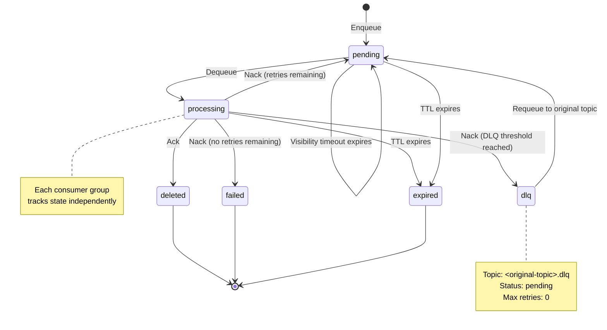

# Queue Concepts

## Queue Mechanics

### Data Model

Messages are stored in a single `messages` PostgreSQL table with the following columns:

| Column | Type | Description |
|--------|------|-------------|
| `id` | UUID | Primary key |
| `topic` | TEXT | Topic name (required) |
| `payload` | BYTEA | Message payload (required) |
| `metadata` | JSONB | Optional metadata |
| `key` | TEXT | Optional deduplication key (nullable) |
| `status` | TEXT | One of `pending`, `processing`, `deleted`, `failed`, `expired` |
| `retry_count` | INTEGER | Number of times the message has been nacked |
| `max_retries` | INTEGER | Maximum retries allowed for this message |
| `last_error` | TEXT | Error message from most recent nack |
| `visibility_timeout` | TIMESTAMPTZ | When the message becomes visible again (null until dequeued) |
| `expires_at` | TIMESTAMPTZ | When the message expires (null if no TTL) |
| `original_topic` | TEXT | Original topic if this is a DLQ message; null otherwise |
| `dlq_moved_at` | TIMESTAMPTZ | When the message was promoted to DLQ; null otherwise |
| `created_at`, `updated_at` | TIMESTAMPTZ | Lifecycle timestamps |

**Indexes**:
- Composite index on `(topic, status, visibility_timeout, created_at)` for efficient dequeue queries
- Unique partial index on `(topic, key)` where `key IS NOT NULL AND status = 'pending'` for key-based upserts

### Visibility Timeout

When a message is dequeued, it transitions to `processing` status and becomes **invisible** to other consumers for a configurable period (default 30 seconds). This is the **visibility timeout**.

If the consumer crashes without acknowledging the message, the visibility timeout expires and the message becomes `pending` again, allowing another consumer to pick it up.

**Per-dequeue override**: Clients can override the visibility timeout on a per-dequeue basis:

```bash
curl -X POST http://localhost:8080/api/messages/dequeue \
  -H "Content-Type: application/json" \
  -d '{"topic": "orders", "count": 1, "visibility_timeout_seconds": 60}'
```

### At-Least-Once Delivery

queue-ti guarantees **at-least-once delivery**:
- Messages are never lost (stored in PostgreSQL)
- A consumer that crashes without acknowledging will have its message retried
- A consumer may receive the same message more than once if it crashes during processing

Your consumer handlers should be **idempotent** — safe to run multiple times with the same message.

## Message Lifecycle



### State Transitions

- **pending** → (dequeued) → **processing** → (acknowledged) → **deleted**
- **pending** → (dequeued) → **processing** → (nacked, retries remaining and below DLQ threshold) → **pending** (automatically retried)
- **pending** → (dequeued) → **processing** → (nacked, DLQ threshold reached) → moved to **`<topic>.dlq`** as **pending** (with max_retries = 0)
- **`<topic>.dlq` pending** → (manually requeued) → **pending** in original topic (resets retry_count and restores max_retries)
- **pending** or **processing** → (TTL expires) → **expired** (marked by automatic reaper)
- **pending** → (dequeued) → **processing** → (visibility timeout expires) → **pending** (automatically reappears)

## Message Keys and Upsert Semantics

Messages can have an optional `key` field that enables deduplication and idempotent enqueue operations.

### Key Behavior

- **Keyless messages** (`key = null`) always insert a new row; multiple enqueue calls produce multiple messages.
- **Keyed messages with no conflict** — A message with a key where no other pending message exists for that `(topic, key)` pair inserts a new row as usual.
- **Keyed messages with pending conflict** — If a pending message already exists for `(topic, key)`, the existing row is **upserted** in place: `payload`, `metadata`, and `updated_at` are replaced, the message ID remains the same, and no new row is created.
- **Keyed messages with processing conflict** — If the message is already being processed (`status = 'processing'`), it is **never upserted**. A best-effort insertion occurs instead, which may fail with a constraint violation. This prevents interrupting in-flight work. Retry the enqueue after the in-flight message completes.

### Use Cases

- **Idempotent producers** — Safely replay enqueue calls without creating duplicate work
- **State synchronization** — Update a pending order with the latest customer information before a consumer picks it up
- **Request deduplication** — Associate one message per user request ID, replacing stale entries with new ones

### Example

```bash
# Enqueue with key
curl -X POST http://localhost:8080/api/messages \
  -H "Content-Type: application/json" \
  -d '{"topic": "orders", "key": "order-42", "payload": "eyJhbW91bnQiOjk5fQ=="}'

# Response (ID is "abc123")
{"id": "abc123"}

# Enqueue the same key with updated payload
curl -X POST http://localhost:8080/api/messages \
  -H "Content-Type: application/json" \
  -d '{"topic": "orders", "key": "order-42", "payload": "eyJhbW91bnQiOjEwMH0="}'

# Response returns the same ID (upserted, not duplicated)
{"id": "abc123"}
```

## Dequeue Algorithm

1. Query for the oldest pending message in the topic that is either not yet visible or has expired visibility, has not exceeded its retry limit, and has not expired by TTL.
2. Use `FOR UPDATE SKIP LOCKED` to prevent concurrent consumers from acquiring the same message.
3. Transition the message to `'processing'` status and set `visibility_timeout` to `now() + [visibility timeout duration]`.
4. Return the message to the consumer.

The `FOR UPDATE SKIP LOCKED` approach ensures **contention-free concurrent consumption** — multiple consumers can dequeue from the same topic without lock contention on the message table.

## Message Statuses

- **pending** (yellow badge) — Ready to be dequeued (initial state after enqueue, or reset after a nack with retries remaining, or after requeue from DLQ)
- **processing** (blue badge) — Currently held by a consumer (after dequeue, until ack or nack)
- **deleted** — Acknowledged by consumer; permanently removed from the queue
- **failed** (red badge) — Nacked with no retries remaining (only when DLQ threshold is disabled or message has not reached threshold)
- **expired** (orange badge) — Marked by the expiry reaper after TTL elapsed

## Dead-Letter Queue Details

When a message reaches the DLQ threshold, it is automatically promoted to a separate queue with the topic name `<original-topic>.dlq`. For example, messages from the `orders` topic that exceed the DLQ threshold are moved to `orders.dlq`.

In the DLQ topic:
- The message is stored with `status = 'pending'` and `max_retries = 0`, preventing automatic retries
- `original_topic` is set to the source topic (e.g., `orders`)
- `dlq_moved_at` is set to the promotion timestamp
- `retry_count` resets to 0

To reprocess a DLQ message, call the `POST /api/messages/:id/requeue` endpoint. This restores the message to its original topic with `retry_count = 0` and `max_retries` restored to the effective DLQ threshold for that topic (per-topic `max_retries` if configured, otherwise the global `dlq_threshold`), allowing it to be dequeued and processed again.

> **Note:** The DLQ topic name (`<topic>.dlq`) is reserved. Attempting to enqueue directly to a topic ending in `.dlq` returns an error.

## Message TTL and Expiry

Messages can have an optional time-to-live (TTL). After the TTL expires, a message is marked as `expired` by the automatic **expiry reaper** and can be permanently deleted by the **delete reaper**.

### Expiry Reaper

- Runs automatically every 60 seconds (if `queue.message_ttl` is not 0)
- Marks messages as `expired` when their `expires_at` timestamp has passed
- Does not delete messages, only marks them with `status = 'expired'`
- Can be triggered manually via `POST /api/admin/expiry-reaper/run`

### Delete Reaper

- Runs on a cron schedule configured by `queue.delete_reaper_schedule` (if set; default is empty/disabled)
- Permanently deletes messages with `status = 'expired'`
- Can be triggered manually via `POST /api/admin/delete-reaper/run`

See [Configuration](./configuration) for details on setting the TTL and configuring the reapers.

## Per-Topic Configuration

Individual topics can override the global queue settings. This is useful when certain topics require stricter retry limits, longer TTLs, queue depth constraints, or rate limiting.

**Supported overrides:**
- `max_retries` — Maximum retry count for messages on this topic **and** the DLQ promotion threshold (overrides both global `max_retries` and `dlq_threshold`). When set, a message is promoted to the DLQ after this many failed attempts instead of the global threshold.
- `message_ttl_seconds` — Time-to-live for messages in seconds (overrides global `message_ttl`); set to `0` to disable TTL for this topic
- `max_depth` — Maximum number of pending+processing messages allowed on this topic; set to `null` or `0` for unlimited; `Enqueue` returns HTTP 429 when the topic reaches capacity
- `throughput_limit` — Maximum messages per second allowed to be dequeued from this topic; set to `null` or `0` for unlimited; when exhausted, dequeue returns fewer messages than requested (soft limiting, not an error)

**Precedence:** Per-topic overrides take priority over global defaults. Omitting a field (or sending `null`) reverts that setting to the global default.

**Set per-topic configuration:**

```bash
curl -u admin:secret -X PUT http://localhost:8080/api/topic-configs/orders \
  -H "Content-Type: application/json" \
  -d '{
    "max_retries": 5,
    "message_ttl_seconds": 3600,
    "max_depth": 1000,
    "throughput_limit": 100
  }'
```

The admin UI **Config** tab allows interactive viewing and editing of all topic configurations without server restart.

**Caching:** Topic configs are cached (like schemas) to avoid repeated database lookups. When Redis is configured, configs are cached in two tiers (in-process + Redis) with a 30-second TTL; changes to a config automatically invalidate caches across all instances via Redis pub/sub.
